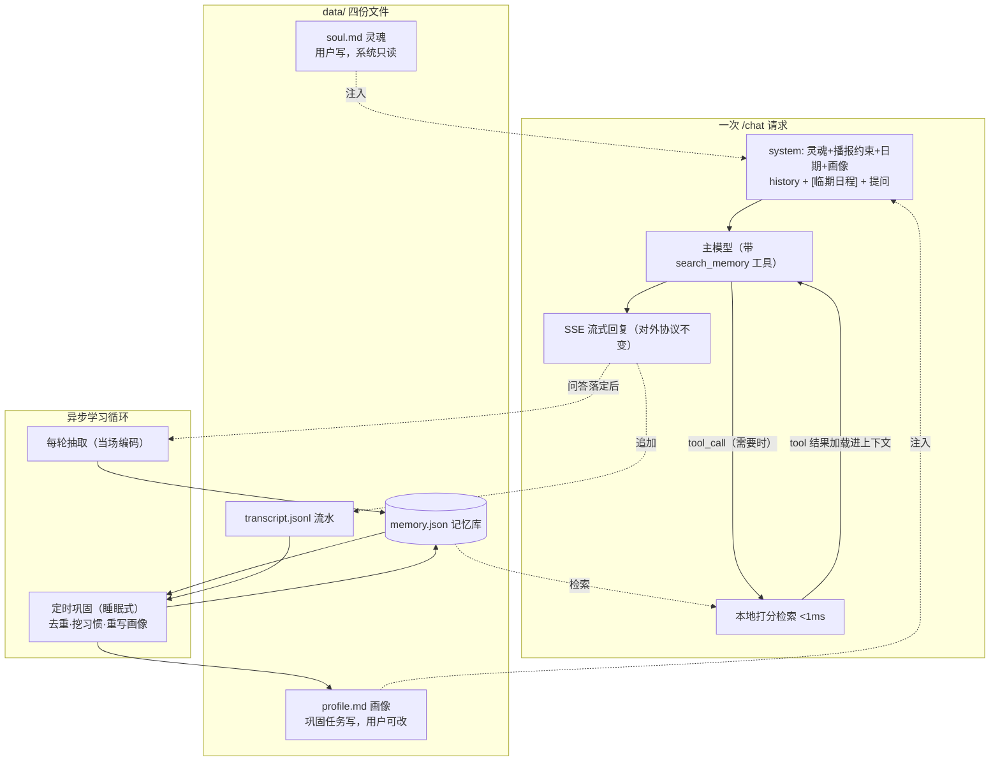

# Assistant 长期记忆与人格设计方案

本文是 [`examples/assistant`](../README.md) 长期记忆与人格功能的设计方案（只讲设计，不含实现）。

方案完全在 assistant 内部实现：对外接口 `/chat` 的请求与响应格式**一个字都不变**（工具调用在服务内部闭环完成），任何调用方都无需改动、也无从感知。本文的所有设计依据都来自 assistant 自身的代码与定位，不依赖任何特定客户端。

## 一、背景与目标

### 1.1 现状

assistant 目前的"记忆"只有 `SessionStore` 里最近 10 轮问答：纯内存、重启即清、闲置 30 分钟即清。人格也只有一段写死在 `.env` 里的系统提示词。于是它既没有性格，也不认识这个家。

### 1.2 目标：有灵魂、越用越了解、越用越智能

1. **有灵魂**：助手有一份用户可编辑的"灵魂"文件定义性格（活泼可爱、沉稳大方、毒舌傲娇……随用户写），人格稳定、改文件即生效。
2. **记得住**：对话中透露的个人/家庭信息自动沉淀，记忆库可无上限增长，不被 prompt 预算封顶。
3. **用得上**：记忆**按需进入对话**——模型在需要时通过工具调用检索记忆库，把相关记忆灵活加载进上下文。
4. **炼得出**：零散记忆被后台定时任务持续提炼成对用户/家庭的**理解**（画像），泛化问题也答得越来越合口味。
5. **管得住**：灵魂、画像都是本地 Markdown，直接改；记忆可用自然语言增删，也可编辑文件。

"越用越智能"对应三条随使用单调上升的曲线：库的广度（每轮抽取只增不封顶）、理解的深度（定时巩固炼画像与习惯）、检索的准度（使用频次与时近度反馈进打分）。

### 1.3 非目标（v1 不做）

- **按人区分记忆**：`/chat` 的输入只有 `text` 文本，没有说话人标识，记忆按"部署实例"维度记（见 12.1）。
- **读时向量检索**：默认档不做，作为检索后端可选档保留（见 4.6）。
- **定时提醒的调度执行**：记忆可以存下"每天九点吃药"，但定时触发与播报超出"收文本 → 出文本"的边界，放在阶段三（见 13）。

### 1.4 设计原则

- **对外接口零侵入**：`/chat` 协议不变；工具调用循环在服务内部完成，调用方只看到正常的文本流。
- **零新增重依赖**：不引数据库、不引向量库。Markdown + JSON 文件 + 现有 openai SDK。
- **给人改的用 Markdown，给机器用的用 JSON**：灵魂和画像是给人看、给人改的 → Markdown；记忆库要 id、字段、程序化读写 → JSON。
- **写时智能、读时廉价**：抽取、打标、巩固、画像全在异步侧；检索的执行器是本地打分，工具调用只是触发方式。

## 二、总体设计：四份文件 + 工具化召回

### 2.1 四份本地文件

助手的"心智资产"全部落在 `data/` 目录，可备份、可迁移、可直接编辑：

| 文件 | 格式 | 谁写 | 谁读 | 角色 |
| --- | --- | --- | --- | --- |
| `soul.md` | Markdown | **只有用户**（系统永不改写） | 每次请求注入 system prompt | **灵魂**：性格、说话风格、自称、边界 |
| `profile.md` | Markdown | 定时巩固任务（用户也可改） | 每次请求注入 system prompt | **画像**：对用户/家庭的理解 |
| `memory.json` | JSON | 抽取器/巩固器 | `search_memory` 工具检索 | **记忆库**：结构化明细，可无限增长 |
| `transcript.jsonl` | JSONL | 每轮问答追加 | 定时巩固（模式挖掘原料） | **流水**：近期原始对话 |

灵魂与画像刻意分离：**人格是设定的，理解是习得的**。灵魂由用户执笔、系统只读不写（助手不应该悄悄改变自己的性格）；画像由系统习得、用户可纠正。"清空所有记忆"清画像、库、流水，**不碰灵魂**。

### 2.2 提示词分区

| 区 | 内容 | 变化频率 | 维护方式 |
| --- | --- | --- | --- |
| **静态区**（system prompt） | 灵魂 + 内置播报约束 + 今天日期 + 画像 | 灵魂：用户改才变；画像：天级 | 灵魂用户写；画像由后台定时巩固自动提炼 |
| **动态区** | 会话历史 + 临期日程 + 本次提问 | 每次请求 | 现状机制 + 临期自动注入（4.3） |
| **按需加载** | 记忆库明细 | 模型决定 | **`search_memory` 工具调用**，结果作为 tool 消息进入上下文（4.2） |



### 2.3 与人脑机制的对应

| 人脑 | 本设计 | 工程上为什么这样 |
| --- | --- | --- |
| 人格/自我（相对恒定） | `soul.md`，用户执笔，系统不改 | 性格不该被数据漂移，改变人格是主人的权利 |
| 海马体当场快速编码 | 每轮对话后异步抽取入库 | 会话在内存里、有 TTL、随时可能重启——**经历转瞬即逝，必须当场记**，不能等定时任务 |
| 睡眠巩固：整理经历、沉淀认知 | 后台定时巩固：从库 + 流水提炼画像、挖习惯 | 提炼要看全局、耗 token、不赶时间，天然适合低频后台跑 |
| 主动回忆（"让我想想"） | `search_memory` 工具调用 | 模型最清楚自己缺什么信息，检索词由它结合完整上下文生成 |
| 前瞻记忆（到点想起要做的事） | 临期日程自动注入（4.3） | "明天有钢琴课"是推送型记忆，模型不可能主动想到去查 |
| 遗忘曲线 | 时近度衰减进打分、巩固时淘汰陈旧低价值条目 | 防止库越大噪声越大 |

人脑还有一种"线索自动激活"的联想（听到名字，相关记忆不召自来），对应可选加速档 `MEMORY_PRE_RECALL`（4.5，默认关）：追求极致响应时把本地预召回打开，模型少查一轮。

### 2.4 为什么不全量注入

把所有记忆编成摘要塞进 system prompt 实现最简单，但与目标根本冲突：知识量被预算封顶（用得越久丢得越多）、无关记忆稀释注意力（越多越笨）、记忆一变缓存全失效。分区 + 工具化按需加载同时解决三者：库无上限、上下文只进相关内容、静态区稳定可缓存。

### 2.5 关键决策一览

| 决策点 | 选择 | 备选及否决理由 |
| --- | --- | --- |
| 人格载体 | `soul.md`，独立于记忆系统 | 写进 `.env` 系统提示词：多行文本难编辑、无热更新（保留为兼容入口，见 4.1） |
| 静态记忆载体 | `profile.md` Markdown | 混在 memory.json 里：画像是给人看和改的，不该埋在机器格式里 |
| 记忆进入对话 | **`search_memory` 工具调用**，结果作为 tool 消息加载进上下文 | 全量注入：见 2.4；纯自动预召回：系统猜不如模型自己知道缺什么，且猜错就是白注入 |
| 工具传输 | 标准 function calling，流式 | 部分 OpenAI 兼容服务的流式工具调用不稳 → 提供文本标记 fallback（4.4），语义不变只换传输 |
| 检索执行器 | 本地打分（写时生成检索键） | 读时 embedding：多一跳网络（留作后端可选档）；让 LLM 逐条筛：太慢 |
| 画像维护 | 后台定时任务（天级）+ 兜底触发 | 每轮更新：画像本应稳定，频繁改写费 token 又毁缓存 |
| 记忆产生 | 每轮之后异步 LLM 抽取（反思式） | 只靠定时任务从聊天记录提炼：会话易失，等不到定时任务就没了 |
| 删除入口 | 自由表达走抽取器；"清空所有记忆"走关键词 | 全靠关键词：覆盖不了自由说法 |

### 2.6 成长曲线（预期形态）

- **第 1 天**：装好即有人格（灵魂模板），库空画像空。
- **第 1 周**：几十条记忆，问到即查即中。
- **第 1 个月**：定时巩固产出画像和习惯，泛化问题不查库也答得合口味（画像兜底，还省一轮检索）。
- **第 1 年**：几千条记忆，检索照样 <1ms，画像浓缩成几百字精华，常问主题因强化信号排序更靠前。

## 三、四份文件的数据模型

### 3.1 `soul.md`（灵魂）

首次启动若不存在则自动生成模板，之后**系统永不改写**。仓库自带一份可直接使用的完整模板 [`data/soul.md`](../data/soul.md)（活泼可爱的小管家人设，实现时以它作为内置模板的来源）。结构节选：

```markdown
# 我是谁
我叫小蜜，是这个家的 AI 小管家。

# 性格
活泼可爱，反应快，偶尔调皮，但办正事的时候很靠谱。

# 说话风格
- 轻快的短句，像家人聊天，不打官腔
- 可以适度用语气词（呀、啦、咯），但别腻

# 边界
- 不知道就说不知道，绝不编造
- 不主动提起记忆里的隐私细节
```

灵魂只写"我是谁"，**不写格式要求**——语音播报约束（口语短句、带标点、无 Markdown）是传输层需求，内置在代码里，不随人格变化，也防止用户改灵魂时不小心弄坏播报。

### 3.2 `profile.md`（画像）

```markdown
# 称呼与家庭
用户是两口之家加一个女儿朵朵（小学二年级）……

# 口味与偏好
全家不吃辣；周五晚上常点外卖……

# 习惯与作息
每天早上 7 点左右会问天气……

# 近期安排
- 2026-07-18 朵朵有钢琴课
- 2026-07-21 用户去北京出差

# 近况
……
```

固定分节、预算 `MEMORY_PROFILE_MAX_CHARS`（默认 1000 字）、**只由定时巩固任务改写**（见六）。用户手工编辑同样生效（热加载）且被巩固保留：巩固的输入包含现画像全文，提示词要求**保留未被新证据矛盾的人工内容**；每次改写前先备份。

### 3.3 `memory.json`（记忆库）

```jsonc
{ "version": 3, "memories": [
  {
    "id": "m_x7k2p9",
    "content": "朵朵对花粉过敏",            // 一句话、自包含、第三人称、≤50 字
    "type": "fact",                        // profile | preference | fact | event | task | habit
    "subjects": ["朵朵"],                   // 关于谁/什么，检索主键（抽取器生成）
    "keywords": ["过敏", "花粉"],           // 补充检索词，含常见别称（"女儿"与"朵朵"同挂）
    "importance": 4,                        // 1~5，长期价值
    "dueAt": null,                          // event/task 可选：临期注入用
    "createdAt": "2026-07-17T09:30:00+08:00",
    "updatedAt": "2026-07-17T09:30:00+08:00",
    "hits": 3,                              // 被检索命中次数（强化信号）
    "lastUsedAt": "2026-07-16T20:11:00+08:00",
    "evidence": "朵朵一到春天就打喷嚏是花粉过敏" // 原话摘录，仅供审计
  }
]}
```

启动全量载入内存，变更即**原子写**（临时文件 + `rename`）落盘；所有写操作经单写者队列（见八）。几千条 = 几百 KB，全内存毫无压力。

### 3.4 `transcript.jsonl`（对话流水）

每轮问答落定后追加一行 `{ts, session_id, user, assistant}`（纯文件操作，无 LLM 调用）。存在的唯一目的是给定时巩固当原料——尤其是**模式挖掘**：单次"问天气"太琐碎，抽取器按防污染原则不记（输出 `[]`），"每天早上都问天气"这个模式只有流水里挖得出来。

保留期 `MEMORY_TRANSCRIPT_DAYS`（默认 14 天），巩固时顺手清理；设 0 则不落流水（牺牲模式挖掘）。隐私影响见 12.3。

Docker 部署时 `data/` 必须挂载卷，否则容器重建四份文件全丢——README 要写明。

## 四、读路径：静态注入 + 工具化按需加载

### 4.1 消息拼装

`src/server.ts` 的 `messages()` 改为：

```
[system]  <soul.md 全文>                        ← 灵魂
          （内置播报约束：口语短句、三句内、正常标点、无 Markdown/表情）
          今天是 2026-07-17，星期五。
          # 你对这个家的了解                     ← profile.md 全文
          ……
          # 记忆工具使用规则
          涉及用户/家庭的具体信息而上文没有时，先调用 search_memory 再回答，
          查不到就如实说不知道，绝不编造；通用知识问题不要检索。
[history] 会话历史（现状不变）
[user]    【今明两天的安排】- 2026-07-18 朵朵有钢琴课   ← 仅有临期日程时注入
          【用户说】明天带朵朵出去玩怎么样
```

- 灵魂、画像以 **mtime 缓存热加载**：每请求 `stat()` 一次（微秒级），文件一改下一句话就生效，无需重启。
- 静态区天级才变、历史逐轮追加，`system + 历史` 前缀稳定，**前缀缓存友好**；动态部分本来就不可缓存。
- 兼容旧配置：`ASSISTANT_SYSTEM_PROMPT` 若设置则整体替换「灵魂 + 播报约束」（标记为 deprecated，README 建议迁移到 `soul.md`）。
- `MEMORY_ENABLED=false` 时不注入画像/日程、不挂工具；灵魂照常生效（人格不是记忆，独立开关见十）。

### 4.2 `search_memory` 工具

**定义**（每次请求随 tools 声明）：

```jsonc
{
  "name": "search_memory",
  "description": "检索你的长期记忆库（关于这个家庭的事实、偏好、事件）。当需要用户/家庭的具体信息而当前上下文没有时，先检索再回答。",
  "parameters": {
    "type": "object",
    "properties": {
      "query": { "type": "string", "description": "空格分隔的检索词：人名、事物、主题，如：朵朵 过敏" }
    },
    "required": ["query"]
  }
}
```

**执行器是本地打分**，<1ms、零网络——工具调用只是触发方式，检索本身不产生额外网络开销。用模型给的 query 词（加上本轮提问文本辅助）作为线索：

```
score = 3.0×命中 subject 数 + 1.0×命中 keyword 数
      + 1.0×时近度(exp(-天数/30)) + 0.4×importance/5 + 0.3×log2(1+hits)
```

取 top-K（`MEMORY_RECALL_TOP_K`，默认 8）且总长 ≤ `MEMORY_RECALL_MAX_CHARS`（默认 1500 字），命中条目回写 `hits`/`lastUsedAt`（异步落盘）。结果以紧凑行文本作为 tool 消息返回——**这就是"动态记忆灵活加载进上下文"的时刻**。

**服务端工具循环**（对外仍是一条普通 SSE，`/chat` 协议不变）：

1. 首次调用带 tools 流式请求；收到文本增量则直接透传给调用方。
2. 收到 tool_call 增量：不透传，聚合完整；若配置了 `MEMORY_SEARCH_FILLER`（默认"让我想想。"），**立即下发这句话作为 delta**——语音场景里这个停顿听起来是在回忆，不是服务卡死。
3. 本地执行检索，把 `assistant(tool_calls)` + `tool(结果)` 追加进消息，再次调用，回答正常流式透传。
4. **上限 `MEMORY_SEARCH_MAX_CALLS`（默认 2）次**；达到上限后剥离 tools 强制作答（防循环）。
5. 检索结果为空时，tool 消息明确写"记忆库中没有相关信息"，配合系统提示让模型如实说不知道（防幻觉）。
6. 断连取消（`res.on("close")` → abort）贯穿整个循环；`SessionStore` 仍只存 user 原文和最终回答，工具消息不进历史（本轮答案已吸收检索内容，跨轮靠答案传递）。

### 4.3 临期日程自动注入（前瞻记忆）

`dueAt` 在未来 3 天内的 event/task（封顶 3 条）随请求自动注入（见 4.1）。这是唯一保留的自动注入：**推送型记忆等不来检索**——用户问"今天有什么安排"模型会查，但"明天有钢琴课"应该在聊到出游时不查自知。条目少而具体，不构成注意力污染。

### 4.4 传输 fallback：文本标记协议

部分 OpenAI 兼容服务的**流式工具调用**不稳（不支持、或 delta 格式不同）。`MEMORY_RECALL_TRANSPORT=marker` 切换为文本标记协议，语义完全不变、只换传输：提示词约定模型在需要检索时第一行只输出 `<搜记忆:朵朵 过敏>`；服务端嗅探首块（首字符非 `<` 立即透传，常规回答零影响），拦截后走同一执行器、同样二次调用。默认 `tools`。

### 4.5 可选加速档：本地预召回（默认关）

`MEMORY_PRE_RECALL=true` 时，每次请求先用提问文本（含最近 2 轮，覆盖跨轮指代）跑一遍本地打分，命中的条目直接随提问注入——对应人脑的"联想自动激活"。命中时模型无需发起检索，省一轮往返；没命中模型照样可以调工具。代价是可能注入无关条目。追求极致响应时打开。

### 4.6 检索后端可选档：embedding（默认关）

`MEMORY_SEARCH_BACKEND=embedding`：写入时异步为每条记忆算 embedding，检索时为 query 算一次（+100–200ms 网络），余弦相似度并入打分。缓解同义改述漏检；默认关——模型生成检索词时通常会自己换几个说法，keyword 后端大多够用。

### 4.7 「你了解我什么」由画像回答

画像常驻，模型自然复述画像——比逐条念记忆更好的回答。逐条明细走文件或 `/memories` 接口（见 7.5）。

## 五、写路径：当场编码

### 5.1 触发时机

`sessions.append()` 成功之后（一轮问答成对落入历史的同一处）做两件事后立即返回，应答链路无感：追加一行流水（3.4）；把这轮投进抽取队列。

**每轮都抽取**而不是只靠定时任务提炼，原因见 2.3：会话易失，经历必须当场编码；定时任务负责"消化"，不负责"记录"。队列天然合并批处理：worker 串行，每次取走全部积压轮次一次调用处理。

### 5.2 抽取调用

输入：与积压轮次可能相关的现有记忆（用 4.2 执行器筛选，另附全部 subjects 词表供对齐用词）+ 积压轮次 + 今天日期。输出严格 JSON 操作数组：

```jsonc
[
  { "op": "add",    "type": "fact", "content": "朵朵对花粉过敏",
    "subjects": ["朵朵"], "keywords": ["过敏", "花粉"], "importance": 4, "evidence": "..." },
  { "op": "update", "id": "m_x7k2p9", "content": "朵朵今年上二年级" },
  { "op": "delete", "id": "m_a3f8q1" }
]
```

抽取提示词核心要求，**防"记忆污染"是重中之重**：

1. 只记**稳定的、日后有用的个人信息**；闲聊、百科、一次性指令不记，**输出 `[]` 是常态**（琐碎模式交给定时巩固从流水里挖）。
2. 重复不 add；矛盾/演进用 update；用户要求忘记用 delete。
3. subjects 与已有词表对齐；相对时间换算绝对日期；event/task 尽量填 `dueAt`。
4. 输入常来自语音识别（无标点、有错字），拿不准**宁可不记**。
5. 只输出 JSON 数组。

校验：解析失败、op 非法、id 不存在 → 整批丢弃打日志，**绝不半套用**，重试 1 次。抽取模型经 `MEMORY_OPENAI_*` 单独配置，缺省复用主模型。写侧不用工具调用：反思式后处理不占应答路径，天然契合。

### 5.3 与取消（断连）的交互

调用方中途断开时，现有语义是中止生成、把已生成部分写入历史。这一轮照常落流水、进抽取队列——用户信息在 user 消息里，不受回复截断影响。

## 六、学习循环：定时巩固

对应人脑的睡眠巩固：后台定时任务，默认每 24 小时检查执行（`MEMORY_CONSOLIDATE_INTERVAL_HOURS`），兜底触发（新增记忆 ≥ `MEMORY_CONSOLIDATE_EVERY_N`，默认 50 条，提前跑）。无新对话、新记忆时空转跳过。

输入：全量记忆库 + 保留期内流水（超预算取最近若干条）+ 现画像全文。做四件事：

1. **去重合并**：同一事实合并为一条（保留最早 createdAt、最新 updatedAt，hits 相加）。
2. **过期清理**：过去的 event/task 删除或改写成事实；importance 低、长期 hits 为零的陈旧条目允许淘汰——遗忘也是记忆系统的功能。
3. **模式挖掘**：从流水归纳 `habit` 型记忆（"每天早上问天气"）——单条太琐碎不值得记，重复中的模式才是理解。
4. **画像重写**：综合全库与流水重写 `profile.md`（分节、预算内、**近期安排节从 dueAt 条目生成**），保留未被矛盾的人工编辑内容。

工程约束：改写 `profile.md` 与替换记忆库前**都先备份**；失败保持原状；与抽取共用一条写队列，执行时机选队列空闲时。

配合检索的使用强化（hits/lastUsedAt 回写），学习循环闭环：**对话 → 当场编码 → 被检索使用 → 强化排序 → 定时巩固成画像与习惯 → 反哺每一次回答**。

## 七、遗忘与用户控制

### 7.1 入口一览

| 用户动作 | 走哪条路 | 效果 |
| --- | --- | --- |
| 说"记住，我不吃辣" | 普通对话 + 异步抽取 | 模型口头确认，抽取器落库 |
| 说"忘掉我说过不吃辣" | 普通对话 + 异步抽取 | 抽取器输出 delete |
| 说"你了解我什么 / 记得朵朵什么" | 画像复述 / 工具检索 | 口头回答 |
| 说"清空所有记忆" | 关键词**精确匹配**，确定性执行 | 备份 → 画像、库、流水全清（**灵魂不动**）→ 固定话术 |
| 改 `soul.md` / `profile.md` | 直接编辑文件 | mtime 热加载，下一句话生效 |

### 7.2 与现有 resetKeywords 的语义冲突

现有默认值 `ASSISTANT_RESET_KEYWORDS=重新开始,清空记忆,忘掉刚才` 清的是**会话窗口**，引入长期记忆后"清空记忆"歧义。方案：会话重置默认值改为 `重新开始,忘掉刚才`（**移除"清空记忆"**，README 写明行为变更）；新增 `MEMORY_WIPE_KEYWORDS=清空所有记忆`，**精确匹配**而非 `startsWith`（"清空所有记忆里关于狗的部分"应落到抽取器，不能被误杀成全量清空）。会话重置不碰长期记忆，记忆清空不碰会话窗口。

### 7.3 清空要有后悔药

一句话触发的不可逆操作是大忌（还有语音误识别风险）。wipe 前把 `memory.json`、`profile.md`、`transcript.jsonl` 备份为 `*-<时间戳>.bak` 留同目录，恢复方式写进 README。巩固改写前同样备份。

### 7.4 删除的连带语义

delete 的记忆可能已炼进画像。删除操作打"画像待刷新"标记，下次定时巩固基于删除后的库重写画像——"忘掉"最终在画像里生效（有延迟；急用"清空所有记忆"）。

### 7.5 HTTP 管理接口（可选）

复用 `ASSISTANT_API_KEY` 鉴权，**新增**端点不动 `/chat`：`GET /memories`（全部记忆+画像）、`POST /memories`、`DELETE /memories/:id`。v1 只做 GET 也够——配合直接改文件。

## 八、并发、可靠性与一致性

### 8.1 单写者队列

所有写操作（抽取套用、流水追加、hits 回写、巩固、wipe、HTTP 删改）经 `MemoryManager` 同一条 promise 链串行，与 `SessionStore.lock()` 相互独立。**wipe 要同时清空抽取队列积压**，否则 pre-wipe 轮次的抽取结果落库，被删的信息"复活"——同队列串行，语义易保证。`soul.md` 系统只读不写，无并发问题。

### 8.2 崩溃语义

变更原子写盘，**已确认的记忆永不丢**；崩溃只丢未抽取的最近几轮和未落盘的 hits——前者与会话窗口易失性同级，后者只是排序参考，不引 WAL。

### 8.3 失败语义

抽取失败重试 1 次仍失败 → 丢弃该批打日志——但**流水已落盘**，定时巩固还能补捞。工具二次调用失败 → 降级为兜底话术。巩固失败 → 保持原状。全部可自愈 + 有日志。

### 8.4 单实例与多会话

单进程单实例设计，不做文件锁与共享存储。会话窗口按 `session_id` 隔离（现状），**长期记忆与人格全局一份**——`session_id` 是对话的边界，不是用户的边界。按用户隔离见阶段三。

## 九、延迟与成本账

| 项 | 应答关键路径影响 | 成本 |
| --- | --- | --- |
| 灵魂/画像热加载 | 每请求 1 次 `stat()`，~0ms | 静态区 ~800–1500 输入 tokens |
| tools 声明 | 0 | 每请求 ~150 tokens |
| `search_memory`（触发时） | +1 次模型往返，~0.5–1.5s，有填补话术 | 触发时多 1 次调用；检索本身 <1ms 本地 |
| 临期日程注入 | 0 | ≤3 条短文本 |
| 每轮抽取 + 流水追加 | 0（异步） | 每批 1 次调用 + 文件 append |
| 定时巩固 | 0（后台，天级） | 每天 ≤1 次全库调用 |
| embedding 后端（可选） | 检索时 +1 次网络（~100–200ms） | 每次检索 1 次 embedding |

不涉及记忆的对话（闲聊、百科）零额外往返。涉及记忆的对话多一轮检索往返——这是"模型自主决定查什么"的固有代价，个人信息场景准确优先于快，且有填补话术把停顿变成"在回忆"的自然感。前缀缓存：静态区天级才变，`system + 历史` 前缀稳定。

## 十、配置项

`.env` 新增（对应 `src/config.ts`）：

| 配置 | 默认值 | 说明 |
| --- | --- | --- |
| `ASSISTANT_SOUL_FILE` | `data/soul.md` | 灵魂文件；缺失时首次启动生成模板；**不受 MEMORY_ENABLED 影响** |
| `MEMORY_ENABLED` | `true` | 记忆总开关（库/工具/画像/流水/巩固），关闭回到纯内存版 |
| `MEMORY_FILE` | `data/memory.json` | 记忆库 |
| `MEMORY_PROFILE_FILE` | `data/profile.md` | 画像 |
| `MEMORY_TRANSCRIPT_DAYS` | `14` | 流水保留天数，`0` 不落盘（牺牲模式挖掘） |
| `MEMORY_PROFILE_MAX_CHARS` | `1000` | 画像预算 |
| `MEMORY_RECALL_TOP_K` / `MEMORY_RECALL_MAX_CHARS` | `8` / `1500` | 检索结果条数/长度预算 |
| `MEMORY_SEARCH_MAX_CALLS` | `2` | 每请求检索次数上限 |
| `MEMORY_SEARCH_FILLER` | `让我想想。` | 检索时先播的填补话术，置空关闭 |
| `MEMORY_RECALL_TRANSPORT` | `tools` | `tools` \| `marker`（流式工具调用不稳的服务商用后者） |
| `MEMORY_PRE_RECALL` | `false` | 可选加速档：本地预召回 |
| `MEMORY_SEARCH_BACKEND` | `keyword` | `keyword` \| `embedding` |
| `MEMORY_CONSOLIDATE_INTERVAL_HOURS` / `_EVERY_N` | `24` / `50` | 定时巩固周期 / 兜底触发 |
| `MEMORY_WIPE_KEYWORDS` | `清空所有记忆` | 精确匹配，执行前自动备份 |
| `MEMORY_OPENAI_BASE_URL` 等 | 复用 `OPENAI_*` | 抽取/巩固专用模型，可用便宜的 |

默认值变更（README 醒目说明）：`ASSISTANT_RESET_KEYWORDS` 由 `重新开始,清空记忆,忘掉刚才` 改为 `重新开始,忘掉刚才`；`ASSISTANT_SYSTEM_PROMPT` 标记 deprecated（仍生效，建议迁移 `soul.md`）。

## 十一、代码结构与改动点

```
examples/assistant/src/
  soul.ts            # 灵魂/画像装载（mtime 缓存热更新）、静态区拼装、灵魂模板生成
  memory/
    store.ts         # MemoryStore：载入、原子落盘、CRUD
    transcript.ts    # 流水：append、按天清理、读取
    search.ts        # 检索执行器：本地打分（纯函数、零 IO，可独立单测）
    extractor.ts     # 抽取提示词与调用、JSON 解析校验
    consolidator.ts  # 定时巩固：去重、过期、模式挖掘、画像(profile.md)重写
    manager.ts       # 对外唯一门面：队列、定时器、wipe、开关判断
  llm.ts             # 扩展：透传 tools、聚合流式 tool_call 增量（纯文本路径保留）
  server.ts          # 工具循环编排、填补话术、临期注入、wipe 分支、/memories（可选）
  config.ts          # 新增 soul/memory 配置段
  .env.example       # 新增配置说明
```

`session.ts` 原样保留；`/chat` 与 `/health` 对外行为不变，调用方零改动。`MEMORY_ENABLED=false` 时 manager 全部 no-op、不挂工具、定时器不启动；灵魂独立生效。

## 十二、边界与已知取舍

1. **实例级而非个人级**。无说话人标识，谁说话都记成"用户"。缓解：自报身份（"我是爸爸……"）写进 content 和 subjects。按人隔离等阶段三。
2. **输入错误可能固化成错误记忆**。语音识别错字会被当真。缓解：`evidence` 可审计、存疑不记、口头更正（→ update）。
3. **隐私是明文的，流水放大了范围**。四份文件明文在本地磁盘；画像、检索结果随请求发给大模型服务商。README 提示敏感信息自行斟酌；不留流水设 `MEMORY_TRANSCRIPT_DAYS=0`。
4. **检索依赖模型自觉**。该查不查 → 错误的"不知道"（系统提示强约束 + 验收覆盖）；不该查乱查 → 白付一轮往返（说明书限定"个人/家庭信息才查"）。画像兜底高频信息，可选预召回档兜底延迟。
5. **流式工具调用的兼容性参差** → `marker` 传输 fallback，语义不变。
6. **hits 是代理信号**。被检索到 ≠ 被用上，只作排序参考、不决定存废。
7. **"说了没记"的小概率不一致**（8.3）。流水可补捞，接受。

## 十三、分阶段落地

**阶段一：人格 + 记忆闭环**。`soul.ts`（灵魂装载与模板）+ `store` / `transcript` / `search` / `extractor` / `manager` + `llm.ts` 工具支持 + `search_memory` 工具循环 + wipe 与备份。装好即有人格、记得住查得到。验收 1–11。

**阶段二：学习闭环**。`consolidator` 定时任务：去重、过期清理、模式挖掘、`profile.md` 画像重写；hits 强化信号接入打分；临期日程注入；`marker` 传输 fallback。这是区别于"带持久化聊天记录"的部分。验收 12–16。

**阶段三：可选增强**。① `MEMORY_PRE_RECALL` 预召回加速档；② embedding 检索后端；③ 主动提醒：`dueAt` + 分钟级定时器 + 可配置 `MEMORY_REMINDER_WEBHOOK`（到期 `POST {"text":"..."}` 给外部系统，未配置只打日志——保持与任何客户端解耦）；④ 若 `/chat` 增加可选说话人字段（向后兼容），升级按人记忆与按人画像。

## 十四、验收场景

实现后直接用 `curl` 调 `/chat` 逐条验收：

| # | 场景 | 操作 | 预期 |
| --- | --- | --- | --- |
| 1 | 灵魂生效与热更新 | 改 `soul.md` 加"每句话结尾带喵" | 下一条回复即生效，无需重启 |
| 2 | 灵魂与格式隔离 | 灵魂里不写格式要求 | 回复仍是带标点的口语短句（内置约束在） |
| 3 | 记住 → 重启 → 检索 | 发"朵朵对花粉过敏"，重启，问"朵朵能去公园吗" | 日志出现 search_memory 调用，回答提及过敏 |
| 4 | 不该查不查 | 问"珠峰有多高" | 无工具调用，直接回答（零额外往返） |
| 5 | 查空不幻觉 | 问"我的车牌号是多少"（从未说过） | 检索空 → 如实说不知道 |
| 6 | 填补话术 | 触发检索时观察 SSE | 先收到"让我想想。"，再收到答案 |
| 7 | 检索上限防循环 | 构造模型连续检索的问题 | 最多 2 次后强制作答 |
| 8 | 演进更新 / 自由删除 | "女儿升二年级了" / "忘掉我说过不吃辣" | update 不重复新增 / 对应条目 delete |
| 9 | 全量清空不动灵魂 | 说"清空所有记忆" | 画像、库、流水清空且有 `.bak`；`soul.md` 原样 |
| 10 | 防污染 | 连续闲聊/百科十轮 | `memory.json` 零增长（流水正常追加） |
| 11 | 中途断连 | 流式发"记住我对海鲜过敏"后立即 Ctrl-C | 该轮仍落流水、被抽取 |
| 12 | 画像沉淀与人工编辑 | 数天对话后巩固；手工在 `profile.md` 加一行 | 画像非空且准确；人工行在下次巩固后仍在 |
| 13 | 模式挖掘 | 连续多天早上问天气 | 巩固后出现 habit 条目（单轮抽取从未记录它） |
| 14 | 临期注入（前瞻记忆） | 存"明天朵朵有钢琴课"，问"明天出去玩怎么样" | 不检索也能提到钢琴课冲突 |
| 15 | marker fallback | `MEMORY_RECALL_TRANSPORT=marker` 重跑场景 3 | 同样通过，回复无标记外泄 |
| 16 | 流水保留期 | 运行超 14 天 | 过期流水被清理，文件不无限增长 |
| 17 | 一键回退 | `MEMORY_ENABLED=false` 重启 | 除灵魂生效外，行为与纯内存版一致 |
