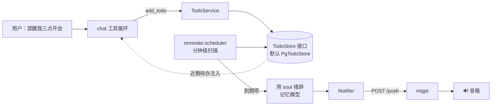

# Assistant 待办与主动提醒设计方案

本文是 [`examples/assistant`](../README.md) **待办清单**与**主动提醒**功能的设计方案（只讲设计，不含实现）。它建立在 [长期记忆与人格方案](memory.md) 之上：那份文档在 1.3 非目标里把「定时提醒的调度执行」推到了阶段三，因为它突破了「收文本 → 出文本」的边界；本文就是来兑现那一段的。

方案完全在 assistant 内部实现：对外的 `/chat` 协议**一个字都不变**；提醒的投递走 [`PROTOCOL.md`](../PROTOCOL.md) 里**早已定义好的推送通道**（外部服务 → 语音前端的 `POST /push`），assistant 只是第一次用它。

## 一、背景与目标

### 1.1 现状

记忆库里已经有 `event`/`task` 类型和 `dueAt` 字段，也有「临期日程自动注入」：`dueAt` 在未来三天内的条目会随请求注入，让模型聊到出游时「不查自知」明天有钢琴课。

但这只是**拉（pull）**——信息在用户开口时被动地进入上下文。缺的是**推（push）**：到了「每天九点吃药」那个点，助手能不能自己开口。这一步要一个到点触发的定时器、一条主动开口的通道，都超出了「收文本 → 出文本」的请求-响应本性，所以记忆方案当初把它留到了后面。

另外，记忆里的 `task` 是**抽取器被动记下来的**（你随口说「下周三体检」它就记了），它没有「用户是否明确要求提醒」的意图，也没有「到点了没、提醒过没」的状态——拿它直接做主动提醒会把每一次随口提到的日期都变成闹钟。

### 1.2 目标

1. **待办清单**：用户能让助手记一条待办（「提醒我三点开会」「记一下要买牛奶」），可带时间、可不带。
2. **主动提醒**：到点了助手用**灵魂的口吻**主动播报，而不是干等用户来问。
3. **数据层可插拔**：待办的存取抽象成一个接口，**默认本地**（Postgres），日后想接 Todoist / CalDAV / 家庭共享清单，换个实现即可，工具层和调度器一行不改。
4. **前台能看能管**：管理台新增一页，列出待办、显示到期时间与状态，能手动增删改。
5. **零侵入、不绑死客户端**：`/chat` 协议不变；投递走 migpt 已有的推送通道，未配置推送时只打日志、功能降级不报错。

### 1.3 非目标（v1 不做）

- **循环提醒**（「每天九点吃药」的重复触发）：要 next-fire 计算和 RRULE 语义，schema 留个位以后加（见五）。v1 只做一次性提醒。
- **提前量**（「提前十分钟提醒」）：v1 里 `due_at` 就是播报时刻，要提前就把时刻设早。
- **按人区分**：和记忆一样是实例级不是个人级（`/chat` 没有说话人标识）。
- **跨设备 / 多音箱**：单实例、一台音箱，同记忆方案的取舍。

### 1.4 设计原则

- **核心归助手，数据可插拔**：待办的「智能」（模型在对话里管理、到点用人格措辞、投递到音箱）搬不出助手；待办的「存储」可以。用**接口**拿可插拔，不用**独立服务**拿——接口在进程内就给足了灵活性，几乎零成本。
- **投递走既有推送通道**：不发明新协议，用 `PROTOCOL.md` 第 8 行那条 `POST /push`。
- **区分被动日程与主动提醒**：记忆里的 `event`/`task` 继续走临期注入（pull）；只有带明确 `remind` 意图的待办才进主动播报（push）。
- **触发状态必须持久**：提醒漏发或重启后重复念都是事故，所以待办（含「提醒过没」）落 Postgres，不像会话窗口那样纯内存。
- **写侧智能、读侧廉价**（沿用记忆方案）：措辞这类花 token 的活儿放在低频的后台触发路径上，不占应答路径。

## 二、边界：待办是两半，答案不同

「待办作为外部服务，还是助手核心模块」这个问题，拆成两半答案才清楚：

| 半边 | 是什么 | 归属 |
| --- | --- | --- |
| **A. 数据与 CRUD** | 建/查/完成/删待办 | **抽接口、默认本地**（可插拔） |
| **B. 调度与投递** | 到点触发 + 用人格措辞 + 送到音箱 | **助手核心**（走 migpt `/push`） |

**A 为什么不做成独立服务**：做成外部服务，它反而得反向回调助手才能干活——

1. 模型要在**对话里当场**管待办（像 `search_memory` 一样在工具循环里调 `add_todo`），跨进程转发只是多一跳。
2. 提醒要用 `soul.md` 的口吻、还可能带画像/记忆上下文，外部服务给不了，除非把整套灵魂重新实现一遍。
3. assistant 是单进程单实例（无 Redis、会话纯内存），为一个待办模块拉独立服务是给不需要分布式的系统加分布式。

所以真正该问的不是「通不通用」，而是**除了助手，还有谁读写这份数据**。只有助手 → 接口 + 本地。将来手机 App / 家人从别的端也写 → 那时抽出成真服务，换掉 `TODO_STORE` 的实现即可，工具与调度不变。

**B 为什么搬不走**：调度器要读 `soul.md` 措辞、要够到音箱、要维护「提醒过没」的状态，这三样都长在助手身上。数据外置得再干净，这个「提醒核」也留在助手。



## 三、和长期记忆的关系（几个要接对的缝）

待办和记忆里的 `event`/`task` 长得像，但**投递语义不同**，要划清界限，否则会双重记录、重复打扰。

| | 记忆 event/task | 待办 todo |
| --- | --- | --- |
| 怎么产生 | 抽取器**被动**从对话里记（陈述句「我三点有个会」） | 用户**显式**命令（「提醒我三点开会」） |
| 进对话的方式 | 临期注入（**pull**，聊到才现身） | 到点主动播报（**push**，闹钟） |
| `dueAt` 精度 | **日历日**（`text`，`2026-07-18`，无时区） | **时刻**（`timestamptz`，精确到分） |
| 有无触发状态 | 无 | 有（`fired_at` / `status`） |

**关键差异是 `dueAt`**：记忆的 `dueAt` 刻意存成日期字符串（见 memory.types.ts 的注释——按 UTC 解析 `new Date("2026-07-18")` 东八区会差一天），因为它表达的是「哪天」。而提醒要「几点几分」，必须是带时区的时刻。所以**待办不能复用记忆那套日期存储**，`due_at` 用 `timestamptz`。

**不双重记录**：「提醒我三点开会」是**指令**——抽取器的防污染原则本就写着「一次性指令不记」，所以它进待办、不进记忆，天然不打架。只有「我三点有个会」这种**陈述**才进记忆。要在抽取提示词里补一句：已经转成待办的别再抽进记忆。

**临期注入照旧、再并上近期待办**：`chat.service` 的 `userMessage()` 现在注入 `memory.upcoming()`；扩展成也带上未来数天内的待办（`todo.upcoming()`），让模型在对话里有 ambient 感知。这和主动播报是两条独立的路（对话内感知 vs 独立闹钟），一条 pull 一条 push，可以共存。

**`清空所有记忆` 不碰待办**：待办是用户**未兑现的承诺**，不是记忆。`memory.wipe()` 清库/画像/轮次/提炼记录，**不动 todos**。待办有自己的完成/取消入口。这条要在实现时明确划清——别顺手把 todos 也 truncate 了。

## 四、可插拔的数据层

这是整个方案里「通用性」的落点。

```ts
export const TODO_STORE = Symbol("TODO_STORE");

export interface TodoStore {
  add(input: NewTodo): Promise<Todo>;
  list(filter?: TodoFilter): Promise<Todo[]>;      // 前台、list_todos 工具
  get(id: string): Promise<Todo | null>;
  complete(id: string): Promise<Todo | null>;
  cancel(id: string): Promise<Todo | null>;
  remove(id: string): Promise<boolean>;            // 前台硬删
  update(id: string, patch: TodoPatch): Promise<Todo | null>;

  // 调度器专用
  dueForReminder(now: Date, maxLateMs: number): Promise<Todo[]>;
  markFired(id: string, at: Date): Promise<void>;
  snooze(id: string, until: Date): Promise<Todo | null>;
}
```

`todo.module.ts` 里 `{ provide: TODO_STORE, useClass: PgTodoStore }`。想接外部系统，写个实现同接口的 `ExternalTodoStore`（内部去打 Todoist / CalDAV 的 API），把 `useClass` 换掉——`TodoService`、`reminder.scheduler`、`todo.controller` 全都只依赖 `TODO_STORE`，一行不改。

| 决策点 | 选择 | 备选及否决理由 |
| --- | --- | --- |
| 数据层形态 | `TodoStore` 接口 + 默认本地实现 | 独立部署的外部服务：只有助手一个读写方时是过度设计，多一跳网络（还在应答路径上）、一个故障源、一套鉴权 |
| 默认存储 | Postgres（`todos` 表） | 内存：提醒的「触发过没」重启就丢，会重复念或漏念 |
| 换外部 | 换 `TODO_STORE` 的 `useClass` | 在 `TodoService` 里写 `if (external)` 分支：把两种实现的细节漏进业务逻辑 |

**注意**：即便接了外部存储，`fired_at`/`snoozed_until` 这类**提醒生命周期状态**通用 todo 系统（Todoist 等）多半不建模。所以要么外部实现自己想办法存，要么在助手侧留一张薄薄的「提醒投递账本」只存这几个字段、用 `todo_id` 关联。v1 默认本地，两者在一张表里，不纠结；抽外部时再处理这道缝。

## 五、数据模型

```sql
CREATE TABLE IF NOT EXISTS todos (
  id            text PRIMARY KEY,          -- t_xxxxx
  content       text NOT NULL,            -- 要做/要提醒的事，一句话
  due_at        timestamptz,              -- 播报时刻；可空（无时间的纯清单项）
  remind        boolean NOT NULL DEFAULT true,   -- 到点是否主动播报
  status        text NOT NULL DEFAULT 'pending', -- pending | done | cancelled
  fired_at      timestamptz,              -- 播报后写入，触发幂等的关键
  snoozed_until timestamptz,              -- 贪睡到此刻前不 fire
  source        text NOT NULL DEFAULT 'voice',   -- voice | web
  created_at    timestamptz NOT NULL DEFAULT now(),
  updated_at    timestamptz NOT NULL DEFAULT now()
  -- 预留（v1 不用）：recur text —— 循环规则，见 1.3
);
CREATE INDEX IF NOT EXISTS todos_due_idx ON todos (due_at) WHERE status = 'pending';
```

字段要点：

- **`remind`** 是重点，也是通用 todo API 给不了的那栏。只有 `remind=true` 的才进主动播报；`remind=false`（「记一下要买牛奶」）只在前台列表和 `list_todos` 里出现，不打扰。
- **`due_at` 可空**：无时间的待办就是纯清单项，不参与调度。带日期不带时间的（「明天提醒我买菜」），由模型补一个默认时刻（`REMINDER_DEFAULT_TIME`，默认 09:00），或直接让模型挑个合理的上午时间。
- **`fired_at`** 兜底幂等：非空就不再 fire（见七）。
- **状态机**：`pending →(到点播报)→ 仍 pending 但 fired_at 有值 →(用户说"知道了/完成了")→ done`；或 `pending →(用户说"算了")→ cancelled`。`snoozed_until` 让「等会儿再提醒我」成立。

对外（前台、工具、提示词）一律用带本地时区偏移的 ISO 字符串（`nowISO()`，形如 `2026-07-18T15:00:00+08:00`），不用 `toISOString()`——理由同记忆方案，别让人和模型在心里做时区加减。

## 六、模型怎么用（工具）

加三个工具，随请求声明（`TODO_ENABLED=false` 时不挂）：

| 工具 | 参数 | 说明 |
| --- | --- | --- |
| `add_todo` | `content`, `dueAt?`（ISO 时刻）, `remind?`（默认按用户是否说「提醒」判断） | 建一条。`dueAt` 由模型把「三点」换算成绝对时刻，同抽取器的相对→绝对换算 |
| `list_todos` | `status?`（默认 pending） | 列待办。「我有哪些待办」走它 |
| `complete_todo` | `id` | 标记完成。「开完会了」「买好了」 |

**和现有工具循环合并**：`chat.service.ts` 现在那个循环只认 `search_memory`（`memory.tools()` / `memory.runTool()`）。要泛化成「认多个工具、按名字 dispatch」：

- `chat.service` 收集 `tools = [...memory.tools(), ...todo.tools()]` 一起声明。
- 收到 tool_call 时，按 `call.name` 路由到 owning service 的 `runTool`。可以给每个域一个 `{ tools(), runTool(call) }` 的小契约，chat 只做分发。
- `MEMORY_SEARCH_MAX_CALLS` 那个「往返上限」的语义不变（防 search 循环）；写类工具（`add_todo`）通常一轮就结束，不构成循环。达到上限摘掉全部工具逼模型作答的逻辑照旧。

| 决策点 | 选择 | 备选及否决理由 |
| --- | --- | --- |
| 待办进对话 | 工具调用（`add_todo` 等） | 关键词匹配「提醒我」：覆盖不了自由说法，时间解析也得靠模型 |
| 工具粒度 | 三个独立工具 | 一个 `manage_todo(action)` 大工具：参数联合类型对小模型更难；三个小工具语义清楚 |
| 成本 | 多几百 token/请求，可 `TODO_ENABLED` 门控 | 记忆方案只有一个工具是刻意的，工具变多小模型可能选错——所以给了开关 |

## 七、调度与投递

`reminder.scheduler.ts`：进程内分钟级定时器（`setInterval`，`unref()`，同记忆的清理定时器风格；或 `@nestjs/schedule`）。每次扫一批到期项，逐条走「措辞 → 投递 → 标记」。

**到期查询**：`status='pending' AND remind=true AND due_at ≤ now() AND fired_at IS NULL AND (snoozed_until IS NULL OR snoozed_until ≤ now())`，且 `due_at` 不早于 `now() - REMINDER_MAX_LATE_MINUTES`（见下）。

**措辞在 fire 时做**，不在建待办时：注入 `soul.md`（复用 `SoulService`），用**记忆模型**（便宜那个 `MEMORY_LLM`）把「三点开会」说成「主人~三点要开会啦，记得带材料哦」。这是低频、不在应答路径上的调用，一次 LLM 往返无所谓；LLM 挂了就退回模板（如「提醒你：三点开会。」）。

**Notifier 抽象**（提醒的唯一对外触点）：

```ts
export interface Notifier { push(text: string): Promise<void>; }
```

- `MigptPushNotifier`：`POST {AGENT_PUSH_URL}/push`，带 `AGENT_PUSH_API_KEY`（`Bearer`）。
- `LogNotifier`：`AGENT_PUSH_URL` 没配时的降级实现，只打日志——正好落地「未配置只打日志、保持解耦」。

**幂等与可靠性**：

- `/push` 返回 **202 是「已接受」不是「已播报」**（协议第十一条）——那是能拿到的最好信号。**拿到 202 才 `markFired`**。
- push 抛错（migpt 没起、网络断）：**不** `markFired`，留着下一分钟重试。
- 但要给迟到设上限 `REMINDER_MAX_LATE_MINUTES`：migpt 断了三天再恢复，不该把积压的提醒一口气全念了。`due_at` 早于 `now() - 上限` 的直接标 `fired_at`（记为「已过期未送达」），不再播。
- 重启安全：状态全在库里，扫描是幂等的——重启不重放（`fired_at` 挡着）、不漏放（没 fire 的下一轮还在）。

**协议层既成事实**（写代码前记着，来自 `PROTOCOL.md`）：提醒会**排队不打断**（音箱在放 AI 回复或音乐时，等它说完再念，可能和音乐混播）；推送文本**不过分句器**，没有「必须带标点」那条约束。

## 八、前台待办页

跟着现有 `memories/ soul/ profile/` 的套路加一处：

- **`apps/web/app/todos/page.tsx`**：列 pending / done / cancelled，显示内容、到期时刻、`remind` 徽标、状态；复用记忆库页那种操作按钮（完成 / 删除 / 手动新增）。`TodoStore` 接口本来就有这些方法，近乎白送。
- **`components/nav.tsx`**：`kLinks` 加 `{ href: "/todos", label: "待办" }`。
- **`lib/api-types.ts`**：加 `Todo` 类型镜像（手动和后端对齐，文件头注释已写明这个约定）。
- **`lib/api.ts`**：加 `todos()` / `addTodo()` / `completeTodo()` / `deleteTodo()`。
- **`app/api/[...path]/route.ts`**：`kAllowed` 白名单加 `"todos"`——那个代理是白名单制，不加浏览器够不到。
- **轮询**：待办变化慢，不用学首页那 1 秒。挂载拉一次 + 操作后重拉，配个 5–10 秒慢轮询让语音新建的待办自己冒出来即可。

## 九、HTTP 接口

`todo.controller.ts`，复用 `ASSISTANT_API_KEY` 鉴权（`@UseGuards(ApiKeyGuard)`），**不碰 `/chat`**：

| 方法 | 端点 | 用途 |
| --- | --- | --- |
| GET | `/todos?status=` | 列待办（前台、调试） |
| POST | `/todos` | 手动加（前台，`source='web'`） |
| PATCH | `/todos/:id` | 改（完成 / 取消 / 贪睡 / 改时间） |
| DELETE | `/todos/:id` | 硬删 |

## 十、配置项

`.env` 新增（对应 `config.ts` 的一个 `todo` 配置段）：

| 配置 | 默认值 | 说明 |
| --- | --- | --- |
| `TODO_ENABLED` | `true` | 待办总开关，关了不挂工具、不启动调度器 |
| `AGENT_PUSH_URL` | （空） | migpt 推送地址，形如 `http://127.0.0.1:4400`；不配则提醒只打日志 |
| `AGENT_PUSH_API_KEY` | （空） | 推送鉴权，要和 migpt 的 `AGENT_PUSH_API_KEY` 一致 |
| `REMINDER_SCAN_SECONDS` | `60` | 调度器扫描间隔 |
| `REMINDER_MAX_LATE_MINUTES` | `120` | 迟到超过这个时长就不再补播（防 migpt 恢复后一次性轰炸） |
| `REMINDER_DEFAULT_TIME` | `09:00` | 只给了日期没给时刻的待办，默认几点提醒 |
| `TODO_OPENAI_*` | 复用 `MEMORY_OPENAI_*` | 措辞用的模型，便宜的就行 |

## 十一、代码结构与改动点

新增 `todo/` 业务域，和 `memory/ soul/` 平级：

```
apps/api/src/todo/
  todo.module.ts          # 装配；{ provide: TODO_STORE, useClass: PgTodoStore }
  todo.controller.ts      # GET/POST /todos、PATCH/DELETE /todos/:id
  todo.store.ts           # TodoStore 接口 + TODO_STORE token（可插拔的缝）
  todo.repository.ts      # PgTodoStore：默认本地实现
  todo.service.ts         # 工具定义与 dispatch、业务逻辑、upcoming()
  reminder.scheduler.ts   # 分钟级扫描 + 触发；措辞 + 投递
  notifier.ts             # Notifier 接口 + MigptPushNotifier + LogNotifier
  todo.types.ts           # Todo / NewTodo / TodoPatch / TODO_CONFIG
```

依赖方向（保持无环）：`chat → todo`；`todo → { soul（措辞）, llm（MEMORY_LLM 措辞）, Notifier, TodoStore }`。todo 不依赖 memory。

改动点：

| 文件 | 改什么 |
| --- | --- |
| `data/postgres.service.ts` | `migrate()` 加 `todos` 表与索引 |
| `app.module.ts` | `imports` 加 `TodoModule` |
| `chat/chat.module.ts` | `imports` 加 `TodoModule` |
| `chat/chat.service.ts` | 工具循环泛化成多工具 dispatch；`userMessage()` 并入 `todo.upcoming()` |
| `memory/extractor.ts`（提示词） | 补一句：转成待办的指令别再抽进记忆 |
| `config.ts` / `env.ts` | 新增 `todo` 配置段 |
| 前台 4 处 | 见八 |
| `.env.example` / `README.md` | 新增配置说明与待办页介绍 |

`PROTOCOL.md` **不用改**——推送通道早就定义好了，本方案只是第一次用它。语音前端侧只需把 `AGENT_PUSH_PORT` 配上（协议附录已有）。

## 十二、并发、可靠性与一致性

- **调度器是单例、单次不重入**：一次扫描没跑完，下一次定时器到点要跳过（加个 `running` 标志），否则慢的 push 会让两轮扫描交叠、同一条 fire 两次。
- **写操作**：待办的增删改本身是数据库事务，量小、不在应答热路径，不需要记忆那种单写者队列。`markFired` 用 `UPDATE ... WHERE fired_at IS NULL` 让「抢先标记」在 SQL 层原子化。
- **崩溃语义**：状态全在库里，重启从库恢复。最坏情况是 push 已发出、`markFired` 前进程崩了 → 重启后重播一次（可接受，远好过漏播）。
- **降级**：`AGENT_PUSH_URL` 没配 → 待办功能照常（能记能查能管），只是提醒不出声、改打日志。`TODO_ENABLED=false` → 整个域 no-op。

## 十三、分阶段落地

**阶段一：待办清单闭环（先不主动提醒）**。`todo.types` + `TodoStore` 接口 + `PgTodoStore` + 建表 + `add_todo`/`list_todos`/`complete_todo` 工具 + 工具循环泛化 + 前台待办页 + HTTP 接口。装好即能记、能查、能在前台管。验收 1–5。

**阶段二：主动提醒**。`reminder.scheduler` + `Notifier`（Migpt/Log）+ fire 时措辞 + 幂等与迟到上限 + `todo.upcoming()` 并入临期注入。到点主动播报。验收 6–10。

**阶段三：可选增强**。① 循环提醒（`recur` + next-fire）；② 提前量；③ 贪睡的自然语言入口（「等半小时再提醒我」）；④ 若接外部 `TodoStore`，处理提醒状态账本那道缝（见四）。

## 十四、验收场景

实现后直接用 `curl` 调 `/chat` 与 `/push`（或看前台）逐条验收：

| # | 场景 | 操作 | 预期 |
| --- | --- | --- | --- |
| 1 | 建带时间的待办 | 发「下午三点提醒我开会」 | 落一条 `remind=true`、`due_at` 为今天 15:00 的待办；前台可见 |
| 2 | 建不提醒的清单项 | 发「记一下要买牛奶」 | 落一条 `remind=false`、`due_at` 空 |
| 3 | 查待办 | 发「我有哪些待办」 | 调 `list_todos`，念出 pending 列表 |
| 4 | 完成 | 发「开完会了」 | 对应待办 `status=done`，前台状态更新 |
| 5 | 前台手动增删 | 前台加一条、删一条 | 后端 `todos` 表相应变化 |
| 6 | 到点主动播报 | 建一条一分钟后的提醒，等着 | migpt `/push` 收到，音箱用人格口吻念出来 |
| 7 | 幂等 | 播报后再等几分钟 | 只念一次（`fired_at` 挡住重复） |
| 8 | 措辞降级 | 措辞模型不可用时到点 | 退回模板话术，仍能播 |
| 9 | 推送未配置 | 不配 `AGENT_PUSH_URL`，到点 | 只打日志不报错，待办照常能记能查 |
| 10 | 迟到不轰炸 | 停 migpt 一段时间超过上限再恢复 | 过期提醒被标记跳过，不一次性全念 |
| 11 | 不双重记录 | 发「提醒我三点开会」后看记忆库 | 进了待办，**没有**同义的记忆条目 |
| 12 | 清空记忆不碰待办 | 有待办时说「清空所有记忆」 | 记忆清空，待办**原样还在** |
| 13 | 一键回退 | `TODO_ENABLED=false` 重启 | 不挂待办工具、不启动调度器，其余不受影响 |

## 十五、已知取舍

1. **投递不保证**（`/push` 是 202 已接受非已播报）。音箱离线时提醒发出去也没人听到，migpt 侧只打日志，助手这边显示「已 fire」。这是推送通道的固有语义。
2. **提醒会和音乐混播**（协议第十一条）。音箱在放歌时提醒直接念，可能听不清——不暂停音乐是 migpt 侧的取舍。
3. **实例级而非个人级**。谁说的「提醒我」都记成同一份待办，和记忆一致。
4. **措辞要一次 LLM 调用**。低频、后台、有模板兜底，但服务商全挂时提醒会退化成干巴巴的模板句。
5. **外部 `TodoStore` 与提醒状态的缝**（见四结尾）。通用 todo 系统不建模 `fired_at`，接外部时要么它自存、要么助手侧留薄账本。
6. **时刻依赖模型解析**。「下午三点」换算成 `15:00` 靠模型；ASR 错字、模糊表述（「傍晚」）可能解析偏差，`evidence`/前台可供人工纠正。
