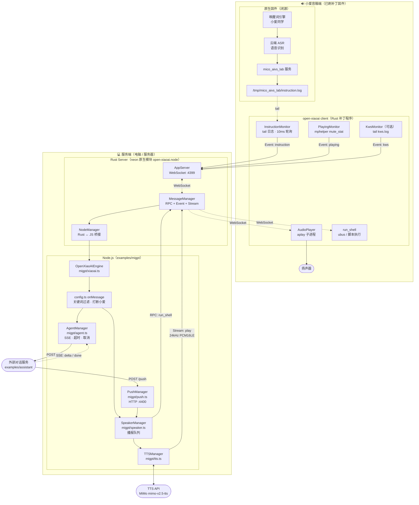
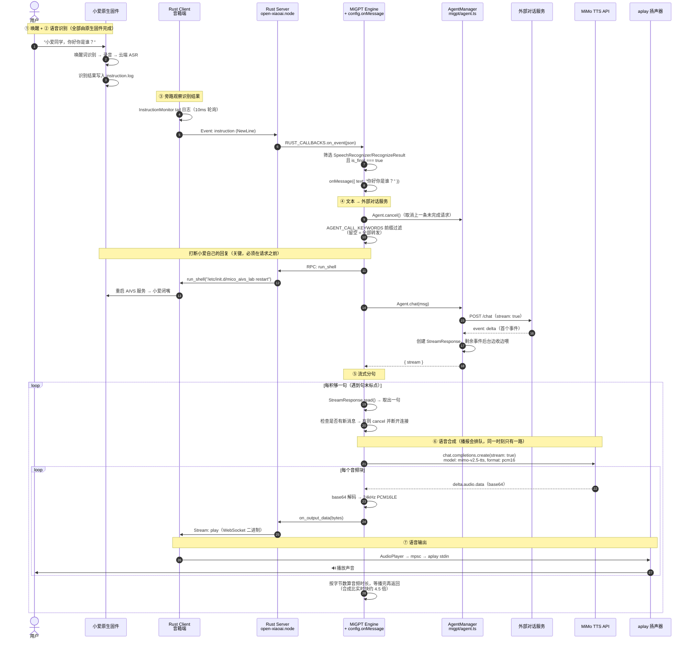
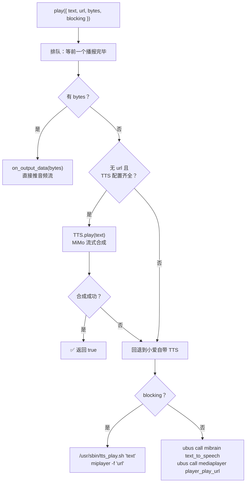

# Open-XiaoAI x MiGPT 端到端链路

本文梳理 `examples/migpt` 从**唤醒**到**语音输出**的完整链路。

接口协议见 [`PROTOCOL.md`](../assistant/PROTOCOL.md)，外部对话服务的参考实现见 [`examples/assistant`](../assistant)。

## 一、核心设计

理解整条链路，先要抓住两个关键点：

> **1. open-xiaoai 不做唤醒词识别，也不做语音识别（ASR），而是「旁路观察」小爱音箱原生固件的识别结果。**

小爱音箱原生固件负责唤醒和云端 ASR，识别结果会写入日志文件 `/tmp/mico_aivs_lab/instruction.log`。
open-xiaoai 的 Rust 补丁程序通过 **tail 这个日志文件**（10ms 轮询）拿到识别出来的文字，转发给服务端。

> **2. migpt 不自己调大模型，只做「耳朵」和「嘴巴」。**

引擎内置的大模型问答（`askAI` / `ChatBot`）已经被完全绕过。`config.ts` 的 `onMessage` 钩子把识别到的文字转发给**外部对话服务**，再把返回的文字播报出来。多轮上下文也归外部服务维护，migpt 侧不留任何记忆。

因此整条链路里：

| 环节 | 由谁完成 |
| --- | --- |
| 唤醒（"小爱同学"） | 小爱原生固件 |
| 语音输入 + 语音识别（ASR） | 小爱原生固件（云端 ASR） |
| 文字获取 | open-xiaoai：tail `instruction.log` |
| **对话问答 + 多轮记忆** | **外部对话服务**（HTTP，见 `examples/assistant/PROTOCOL.md`） |
| 语音合成（TTS） | 服务端：MiMo TTS（可回退到小爱自带 TTS） |
| 语音输出 | 音箱端：`aplay` 播放 PCM 音频流 |
| 主动提醒 | 外部服务 → migpt 的 `POST /push` |

这也解释了为什么本项目能"完美打断"小爱：调用外部服务前先执行 `abortXiaoAI()` 重启 `mico_aivs_lab`，掐掉小爱自己的回复，再用我们自己的 TTS 说话。

## 二、整体架构



## 三、端到端时序图

以用户说「**你好，你是谁？**」为例：



## 四、分阶段详解

### ① 唤醒

| 项目 | 说明 |
| --- | --- |
| 实现方 | **小爱原生固件**，open-xiaoai 不参与 |
| 触发 | 用户说「小爱同学」 |

**连续对话（可选）**：配了 `KEEP_AWAKE=true` 后，回复播完 migpt 会让音箱进入多轮对话，用户不用每轮都说唤醒词，详见下面的「⑨ 连续对话」。需要刷补丁固件。

**自定义唤醒词（可选）**：`examples/kws` 是独立模块（基于 sherpa-onnx），会把识别结果写入 `/tmp/open-xiaoai/kws.log`（格式 `时间戳@关键词`）。`KwsMonitor`（`packages/client-rust/src/services/monitor/kws.rs`）tail 该文件并上报 `kws` 事件。

> ⚠️ 在 migpt 中，`kws` 事件**仅打印日志**，不驱动任何业务逻辑（`migpt/xiaoai.ts:96-99`）。需要自定义唤醒词时要单独安装 `examples/kws`。

### ② 语音输入 + 语音识别（ASR）

| 项目 | 说明 |
| --- | --- |
| 实现方 | **小爱原生固件的云端 ASR** |
| 数据源 | `/tmp/mico_aivs_lab/instruction.log` |
| 监听 | `InstructionMonitor` → `FileMonitor`（10ms 轮询 tail） |
| 代码 | `packages/client-rust/src/services/monitor/instruction.rs` |

> ⚠️ **migpt 没有启用录音链路**。`src/server.rs` 中 `start_recording` 仍被注释掉（`src/server.rs:24`），`AudioRecorder` 和 `record` 音频流未启用，`onRecord` 回调不会被触发。如需在 Node.js 端拿到原始录音流，需取消注释并重新编译。

日志中每行是一条 JSON，引擎只挑出满足以下全部条件的记录：

```
header.namespace === "SpeechRecognizer"
header.name      === "RecognizeResult"
payload.is_final === true
payload.results[0].text 非空
```

> 💡 识别结果**不保证有标点**，常常是「你好你是谁」这样一整串。外部服务不要拿标点做解析。

### ③ 事件上报：设备 → 服务端

```
InstructionMonitor
  → MessageManager.send_event("instruction", { NewLine: "..." })
  → WebSocket（:4399，二进制/文本帧）
  → AppServer::on_stream / on_event（examples/migpt/rust/server.rs）
  → NodeManager::call_fn("on_event")   // Rust → JS 跨线程桥接（neon Channel）
  → global.RUST_CALLBACKS.on_event(json)
  → OpenXiaoAIEngine.onEvent（migpt/xiaoai.ts:69）
```

`onEvent` 处理三类事件：

| 事件 | 处理 |
| --- | --- |
| `instruction` | 解析 ASR 结果 → `onMessage()` 进入对话链路 |
| `playing` | 更新 `OpenXiaoAISpeaker.status`（playing/paused/idle） |
| `kws` | 仅 `console.log` |

### ④ 文本 → 外部对话服务

内置的大模型问答已经被绕过，靠的是 `config.ts` 里的两件事：

1. **`callAIKeywords: []`**（`config.ts:103`）—— 置空后 `MiGPTEngine.onMessage` 里 `askAI()` 那条分支永远不会命中（`[].some()` 恒为 `false`）。`ChatBot` 和内置的 OpenAI client 仍然会被 `super.start()` 初始化，但永远不会被调用。
2. **`onMessage` 钩子接管** —— 钩子返回 `{ text }` 或 `{ stream }` 时，引擎直接拿去播报。

`MiGPTEngine.onMessage` 的执行顺序（`@mi-gpt/engine/dist/index.js`）：

```js
async onMessage(msg) {
  OpenAI.cancel(this.lastMsg?.id);                       // ① 取消内置 LLM 请求（现在是空转）
  this.lastMsg = msg;
  let reply = await this.config.onMessage?.(this, msg);  // ② 我们的钩子
  if (reply?.handled) return;                            // ③ 完全接管
  if (reply && !reply.default) {                         // ④ 返回回复 → 播放
    await this._response(msg, reply);
    return;
  }
  if (this.config.callAIKeywords?.some(...)) { ... }     // ⑤ 内置 LLM（已被 [] 关掉）
}
```

钩子里的完整流程（`config.ts:107-141`）：

| 步骤 | 说明 |
| --- | --- |
| `Agent.cancel()` | 用户抢话时，断开上一条还没结束的 HTTP 请求 |
| `Agent.enabled` 检查 | 没配 `AGENT_BASE_URL` 时直接返回，全部交回小爱原生处理 |
| `kCallKeywords` 前缀过滤 | 读 `AGENT_CALL_KEYWORDS`，**留空表示全部转发** |
| `abortXiaoAI()` | **必须在请求之前**，否则小爱会用自己的云端答案跟我们抢着说话 |
| `Agent.chat(msg)` | 走 `examples/assistant/PROTOCOL.md` 约定的 `POST /chat` |
| 分发结果 | `aborted` → 静默放弃；`fallback` → 等 2s 后 `askXiaoAI()`；否则返回 `{ text / url / stream }` |

> ⚠️ **走钩子路径时，第 ⑤ 步分支里的三件事都不会自动发生**：`abortXiaoAI()` 不会被调用、`callAIKeywords` 不生效、`OpenAI.cancel()` 管不到我们的请求。所以这三件事钩子里都自己做了一遍。

#### AgentManager（`migpt/agent.ts`）

| 能力 | 实现 |
| --- | --- |
| 流式 | SSE。只等到**首个事件**就返回 `StreamResponse`，剩下的在后台边收边喂——引擎才能立刻开始分句播报 |
| fallback / error | 协议约定 `fallback` 必须在任何 `delta` 之前发送，所以看首个事件就能判断 |
| 首事件超时 | `AGENT_TIMEOUT_MS`，默认 10s → 播报兜底话术 |
| 整体超时 | 60s，防止外部服务发了一半就不动了 |
| 取消 | `AbortController`。协议约定「连接即生命周期」，取消就是直接断开连接 |
| 中断区分 | 超时中断和用户抢话用 `signal.reason` 区分：前者播兜底话术，后者静默放弃 |

#### 历史记忆去哪了

migpt 侧**不再保留任何对话记忆**。内置 `ChatBot` 的 history 数组已被绕过，多轮上下文完全由外部服务维护，通过 `session_id`（`AGENT_SESSION_ID`，默认 `default`）关联。

参考实现见 [`examples/assistant`](../assistant)：纯内存、按「轮」成对淘汰、失败的请求不污染上下文、抢话时把已生成的部分记进历史。

### ⑤ 回复 → 流式分句

外部服务的 `delta` 事件写入 `StreamResponse`，按标点切句后逐句播报（`@mi-gpt/stream`）：

| 配置 | 默认值 |
| --- | --- |
| `sentenceEndings` | `。？！；?!;` |
| `maxReplyLength` | 200 |
| `firstReplyTimeout` | 500ms |

`_response()` 循环读取分句，**每句之间检查是否有新消息**，有则 `stream.cancel()` 立即打断：

```js
while (true) {
  const { next, noMore } = stream.read();
  if (!next && noMore) break;
  if (next) {
    if (this._hasNewMsg(ctx)) { stream.cancel(); return; }   // 用户抢话 → 打断
    await this.speaker.play({ text: next, blocking: true }); // 逐句阻塞播放
  }
  await sleep(100);
}
```

> 💡 引擎播报文字时**始终传 `blocking: true`**，依赖 `play()` 真正等到播完才返回，否则多句话会抢跑。

> ⚠️ **外部服务的回复必须带正常标点**。分句器只在 `。？！；?!;` 处切句；一段没有标点的长文本在流结束前**一个字都不会播报**，只能等结束后按 200 字硬切，流式就白做了。反过来 `delta` 想多碎就多碎（逐 token 也行），分句器会自己攒。emoji 会被 `removeEmojis` 自动剔除。

> 💡 `StreamResponse` 的分句参数是**全局的**，由 `ChatBot.init()` 里的 `StreamResponse.init()` 填充。引擎 `start()` 一定在收消息之前跑完，所以线上没问题；但这意味着 `AgentManager` 不能脱离引擎单独使用，否则 `maxReplyLength` 是 `undefined`，分句循环一次都不跑，会**静默返回零个句子且不报错**。

### ⑥ 语音合成（TTS）

`SpeakerManager.play()`（`migpt/speaker.ts`）的分发逻辑：



> 💡 **播报是串行的**。引擎播报 AI 回复和外部服务推送提醒可能同时发生，两股 PCM 流一起写进 `aplay` 会糊在一起，所以 `play()` 用一条 promise 队列把所有播报排队（`migpt/speaker.ts`）。前一个播报失败不会卡住后面的。
>
> 注意这条队列只在 `blocking: true` 时严格成立。`blocking: false` 且启用了自定义 TTS 时，`TTS.play()` 是发出去就不等的，队列会提前释放。引擎和推送都用 `blocking: true`，所以两条主路径都是安全的。

**启用条件**：`TTS.init()` 要求 `baseURL` / `apiKey` / `model` / `voice` **四项齐全**才会启用自定义 TTS；只配了一部分会打印告警并回退到小爱自带的语音合成服务；一项都没配则静默回退。四项均在 `.env` 里配置（`TTS_BASE_URL` / `TTS_API_KEY` / `TTS_MODEL` / `TTS_VOICE`）。

**MiMo TTS 调用**（`migpt/tts.ts`，OpenAI 兼容接口）：

```ts
client.chat.completions.create({
  model: "mimo-v2.5-tts",
  messages: [{ role: "assistant", content: text }],  // 注意：待合成文字走 assistant 角色
  audio: { format: "pcm16", voice: "mimo_default" },
  stream: true,
})
```

逐块读取 `delta.audio.data`（base64）→ 解码为 **24kHz PCM16LE 单声道** → `RustServer.on_output_data(bytes)`。

> 💡 **为什么要等待播放完毕？**
> 实测一句「你好，很高兴认识你！」：合成耗时约 **500ms**，但音频时长约 **2240ms** —— 合成比实时快约 **4.5 倍**。
> 若流结束就返回，`blocking: true` 会提前约 1.7 秒返回，导致下一句抢跑。
> 因此 `tts.ts` 按 `总字节数 ÷ 48000 字节/秒` 计算音频时长，扣除已流逝时间后 sleep 剩余时长。

### ⑦ 语音输出

```
on_output_data(bytes)                       // examples/migpt/rust/lib.rs:34
  → MessageManager.send_stream("play", bytes)
  → WebSocket 二进制帧
  → client.rs on_stream()：tag === "play"   // packages/client-rust/src/bin/client.rs:165
  → AudioPlayer::play(bytes)
  → mpsc channel（容量 50）
  → aplay 子进程 stdin
  → 🔊 扬声器
```

`aplay` 启动参数由 `src/server.rs` 中 `start_play` 的 `AudioConfig` 决定（`src/server.rs:30`）：

```
aplay --quiet -t raw -f S16_LE -r 24000 -c 1 --buffer-size 1440 --period-size 360 -
```

> ⚠️ **必须启用 `start_play`**，否则 `AudioPlayer` 的 sender 为 `None`，`play()` 会静默丢弃音频（不报错、没声音）。
> 音频参数必须与 TTS 输出格式（24kHz / 16bit / 单声道）严格一致，否则会出现变调、加速或杂音。
> 修改 `src/server.rs` 后需要 `pnpm build` 重新编译 `open-xiaoai.node`。

### ⑧ 提醒推送（外部服务 → migpt）

外部服务可以主动让音箱说话，比如定时提醒。`PushManager`（`migpt/push.ts`）在 Node 侧起了一个 HTTP 服务：

```
POST http://{migpt}:{AGENT_PUSH_PORT}/push
{ "text": "该吃药了。" }
→ 202 { "ok": true }
```

| 项目 | 说明 |
| --- | --- |
| 启用 | 配了 `AGENT_PUSH_PORT` 才启动，默认建议 4400 |
| 鉴权 | `AGENT_PUSH_API_KEY`，未配置时不校验 |
| 健康检查 | `GET /health` |
| 播报 | `OpenXiaoAISpeaker.play({ text, blocking: true })`，走和 AI 回复完全相同的 TTS 链路 |

> 💡 **202 表示「已接受」，不表示「已播报」**。播报在后台排队进行，migpt 不等它完成就先应答——否则前面排着一段长回复时，HTTP 请求要被挂住几十秒。播报失败（比如音箱离线）只在 migpt 侧打日志。
> Rust 桥只暴露了 `start` / `run_shell` / `on_output_data` 三个函数，没有连接状态 API，所以做不到「先检查音箱在不在线再应答」。

> ⚠️ **提醒会排队，不会打断**，也不会暂停正在播放的音乐（会混在一起）。

> ⚠️ **`/push` 本质是「让音箱说任意话」的接口**，默认监听 `0.0.0.0`（Docker 需要）。未配置密钥时同网络下任何人都能调用，启动时会打印告警。

### ⑨ 连续对话（多轮对话）

配了 `KEEP_AWAKE=true` 之后，回复播完会让音箱进入多轮对话，用户接着说就行，不用再说一遍唤醒词。

```
回复播完 ──▶ ubus call pnshelper event_notify '{"src":3,"event":4,"detail":"1"}'
         ──▶ mipns：set_wakeup_status / enable asr = 1 / 分配 aivs dialog_id
         ──▶ 音箱自己放提示音（multirounds_tone.opus）+ 点灯
         ──▶ 约 7s 收音窗口（固件写死）──▶ 没人说话就 cloud-asr-timeout 自动退出
```

用户在窗口内说话，走的是和唤醒词**完全相同**的原生链路：小爱自己也会抢答，但那正是 `abortXiaoAI()` 一直在处理的事，所以 `onMessage` 现有逻辑直接复用，不用特殊处理。

**挂在哪**：`OpenXiaoAIEngine.onMessage` 包住了 `super.onMessage()`（`migpt/xiaoai.ts`）。引擎是逐句阻塞播报的（见上面的「⑤ 回复 → 流式分句」），所以 `super.onMessage()` 返回时回复已经播完了，接着触发正好。

**什么时候触发**：只有**我们自己播报了回复**才触发。这件事只有 `onMessage` 钩子的返回值知道，所以 `start()` 里包了一层钩子把它的决定记下来（连着消息 id 一起记，因为用户抢话时消息是并发处理的）：

| 钩子返回 | 含义 | 触发？ |
| --- | --- | --- |
| `{ text / url / stream }` | 我们自己播报 | ✅ |
| `{ handled: true }` | `fallback` 交回小爱，或用户抢话静默放弃 | ❌ 说话的不是我们，不能抢 |
| `undefined` | 关键词没命中，交回小爱原生处理 | ❌ 同上 |
| 有更新的消息进来 | 用户抢话 | ❌ 交给新消息负责 |

外部服务推送的提醒（`/push`）不走 `onMessage`，所以也不会触发。

> ⚠️ **必须刷补丁固件**（`patches/LX06/04-mipns-multirounds.sh`）。原版固件的 mipns 收到这个事件只会报 `unexpected event type: 6`。
> 原版固件下 `KEEP_AWAKE=true` 不会报错，但也不会有任何效果——`pnshelper` 照样返回 `code 0`，**从返回值分辨不出来打没打补丁**，所以 `startMultiRounds()` 的返回值只能证明「命令送到了音箱」。

> ⚠️ **`abortXiaoAI()` 会把 mipns 的状态机卡在 `transmitend`**，这是补丁要改两处的原因。
> 多轮对话只接受 `idle` 状态，而 `transmitend ---> idle` 只有三条路，且**全部由 aivs 驱动**（`dialog finish` / `asr timeout` / `disconnected`）。我们每轮都重启 `mico_aivs_lab` 打断小爱，aivs 一死这三个通知谁也不会来，状态机就再也回不到 `idle`——实测这三个事件在设备整个日志里出现次数都是 **0**。
> 平时这个「卡住」没人察觉，是因为唤醒词走的 `local pre-wakeup` 能从**任何**状态跃迁。所以补丁的第二处就是把状态表里 `transmitend` 指向 `idle` 的处理函数。

> ⚠️ **`wakeUp()` 在 LX06 上是坏的，别用**。它的两个 src 都不是唤醒：实测 `src:1` 是**闹钟**事件（`enter pnshelper event notify src alarm!`），mipns 收到后直接忽略；`src:0` 同理。唯一能唤醒的是声学唤醒词（`rice_wakeup` 两级检测器跑在 `xaudio_engine` 里，带声源测向），**没有任何 ubus/IPC 入口**。
> 顺带一提，`packages/client-rust/src/bin/monitor.rs`（自定义唤醒词）用的也是 `src:1`，所以 `examples/kws` 在 LX06 上同样只会放提示音而不会真的唤醒。

> 💡 **窗口时长不用我们管**。固件写死 7 秒（日志 `animation begin multirounds:7000`），超时自动退出，所以不存在「窗口内麦克风一直在听、把电视声音也转发给外部服务」的问题。

> 💡 **怎么确认补丁生效**：音箱上 `tail -f /var/log/messages`，触发后看到 `local multirounds, idle ---> preparing!` 就是成功，看到 `unexpected event type: 6!` 就是没打补丁。
> 注意 `logread`/`syslogd` 在这个固件上都不存在，日志是 syslog-ng 写到 `/var/log/messages` 的。

## 五、通信协议

### 5.1 服务端 ↔ 音箱端：WebSocket（:4399）

服务端是 Server，音箱端是 Client 主动连接（断线自动重连）。同一时刻只处理一个连接（`src/server.rs`）。

消息类型 `AppMessage`（`packages/client-rust/src/services/connect/data.rs`）：

| 类型 | 方向 | 用途 |
| --- | --- | --- |
| `Event` | 设备 → 服务端 | `instruction`（ASR 结果）、`playing`（播放状态）、`kws`（唤醒词） |
| `Request` / `Response` | 双向 RPC | `run_shell`、`start_play`、`stop_play`、`start_recording`、`stop_recording`、`get_version` |
| `Stream` | 双向二进制 | `tag: "play"`（服务端 → 设备，播放）、`tag: "record"`（设备 → 服务端，录音） |

**`run_shell` 是能力底座**：`speaker.ts` 里几乎所有设备控制（播放/暂停、唤醒、麦克风开关、查询型号、切换启动分区、打断小爱）都是通过 RPC 在音箱上执行 `ubus` 命令或 shell 脚本实现的。

### 5.2 服务端 ↔ 外部对话服务：HTTP

| 通道 | 方向 | 端点 |
| --- | --- | --- |
| 对话 | migpt → 外部服务 | `POST {AGENT_BASE_URL}/chat`（JSON 或 SSE） |
| 推送 | 外部服务 → migpt | `POST {migpt}:{AGENT_PUSH_PORT}/push` |

完整定义见 [`PROTOCOL.md`](../assistant/PROTOCOL.md)。

## 六、关键注意事项

1. **`start_play` 必须开启** —— 否则 TTS 音频流会被静默丢弃。改完 `src/server.rs` 要 `pnpm build`。
2. **采样率必须对齐** —— TTS 输出 24kHz 就必须配 `sample_rate: 24000`，两处不一致会变调。
3. **录音链路默认关闭** —— `start_recording` 仍是注释状态，`onRecord` 不会触发。
4. **ASR 依赖原生固件** —— 音箱必须能正常联网使用小爱的云端语音识别，否则 `instruction.log` 不会有识别结果，整条链路不会启动。
5. **`abortXiaoAI()` 有 1-2 秒恢复期** —— 期间小爱自带 TTS 不可用。配置了 MiMo TTS 后影响较小（走的是我们自己的音频流），但回退路径仍会受影响。引擎原本靠大模型的首字延迟盖住这段窗口，现在靠的是外部服务的响应延迟——如果你的外部服务快到几十毫秒就返回，这里可能需要补一个 sleep。
6. **默认全部转发** —— `AGENT_CALL_KEYWORDS` 留空时，所有识别到的文字都会发给外部服务，小爱原生不再处理任何消息。想保留「只响应请/你开头」的老行为，配 `AGENT_CALL_KEYWORDS=请,你`。
7. **回复必须带标点** —— 否则流式分句失效，详见上面的「⑤ 回复 → 流式分句」。
8. **历史记忆归外部服务** —— migpt 侧不留任何对话记忆，靠 `session_id` 关联。详见 [`examples/assistant`](../assistant)。
9. **播报会排队** —— AI 回复和推送提醒不会同时说话，后到的等前面说完。
10. **推送端口要设密钥** —— `/push` 不配 `AGENT_PUSH_API_KEY` 时同网络下任何人都能让音箱说话。
11. **配置走 `.env`** —— 复制 `.env.example` 为 `.env` 填写即可，启动命令 `tsx --env-file-if-exists=.env` 会自动加载；Docker 运行时也可直接用环境变量传入。`OPENAI_*` 已经不再需要（内置 LLM 被绕过），`TTS_*` 四项缺一不可，否则回退到小爱自带 TTS。
    注意 `pnpm start` 用的是 `tsx` 而不是 `tsx watch`，改完代码要重启才生效。
12. **连续对话默认关闭，且要刷补丁固件** —— `KEEP_AWAKE=true` 打开后，回复播完音箱会进入约 7 秒的多轮对话窗口，不用每轮都说唤醒词。原版固件下开关不报错但没效果，详见「⑨ 连续对话」。
13. **`wakeUp()` 在 LX06 上是坏的** —— 它的两个 src 都不是唤醒（`src:1` 实测是闹钟事件），能唤醒的只有声学唤醒词。想让音箱重新收音请用 `startMultiRounds()`，详见「⑨ 连续对话」。
14. **`setMic()` 的 event 号是反直觉的** —— `event:7` 是**静音**、`event:8` 是取消静音（mipns 日志 `enter notify wakeup mute: 1` 里的 1 就是静音）。搞反会把用户的麦克风哑掉。

## 七、关键代码索引

| 环节 | 文件 |
| --- | --- |
| ASR 结果监听 | `packages/client-rust/src/services/monitor/instruction.rs` |
| 文件 tail 轮询 | `packages/client-rust/src/services/monitor/file.rs` |
| 唤醒词监听（可选） | `packages/client-rust/src/services/monitor/kws.rs` |
| 播放状态监听 | `packages/client-rust/src/services/monitor/playing.rs` |
| 音箱端主程序 | `packages/client-rust/src/bin/client.rs` |
| 音频播放（aplay） | `packages/client-rust/src/services/audio/play.rs` |
| 通信协议（WebSocket） | `packages/client-rust/src/services/connect/data.rs` |
| 服务端 WebSocket | `examples/migpt/rust/server.rs` |
| Rust ↔ JS 桥接 | `examples/migpt/rust/node.rs` · `rust/lib.rs` |
| 引擎与事件分发 | `examples/migpt/src/xiaoai.ts` |
| **外部服务客户端** | `examples/migpt/src/agent.ts` |
| **提醒推送服务** | `examples/migpt/src/push.ts` |
| 设备控制与播报队列 | `examples/migpt/src/speaker.ts` |
| 语音合成 | `examples/migpt/src/tts.ts` |
| 用户配置与消息钩子 | `examples/migpt/src/config.ts` |
| 环境变量读取 | `examples/migpt/src/env.ts` |
| 配置模板 | `examples/migpt/.env.example` |
| **接口协议** | `examples/assistant/PROTOCOL.md` |
| **外部服务参考实现** | `examples/assistant/` |
