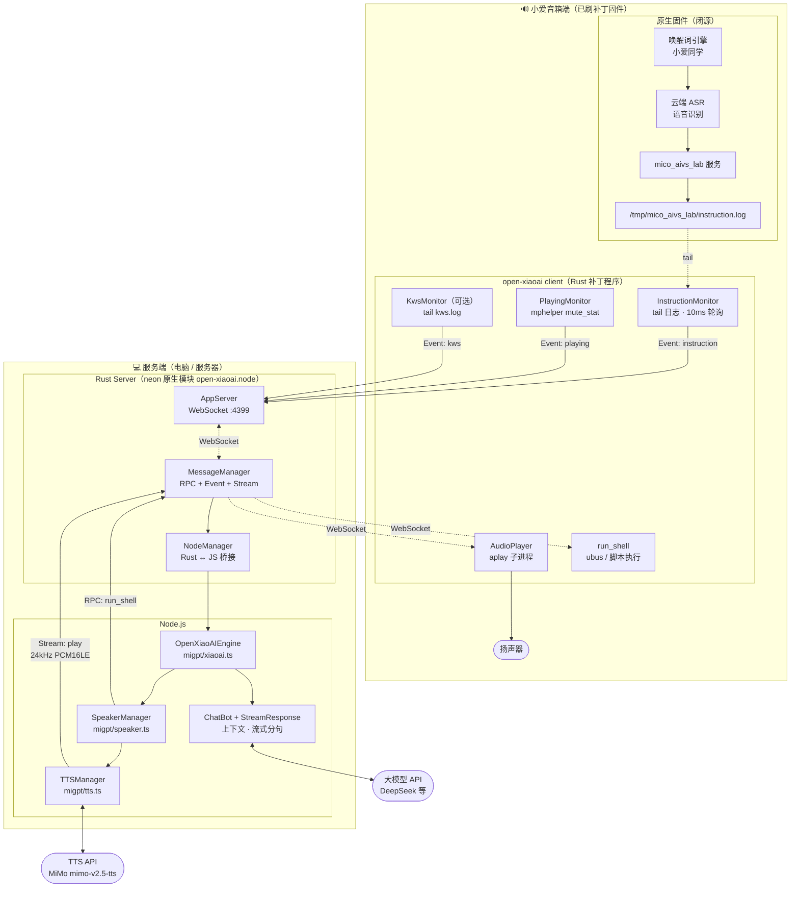
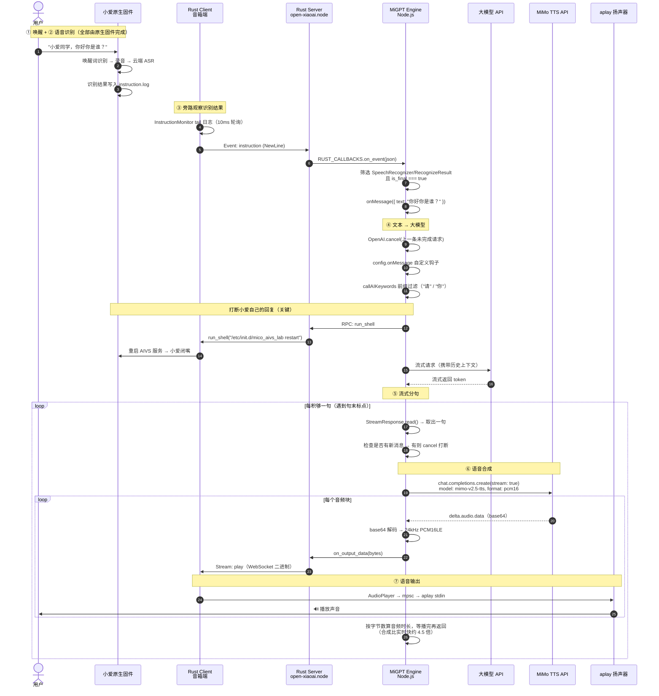
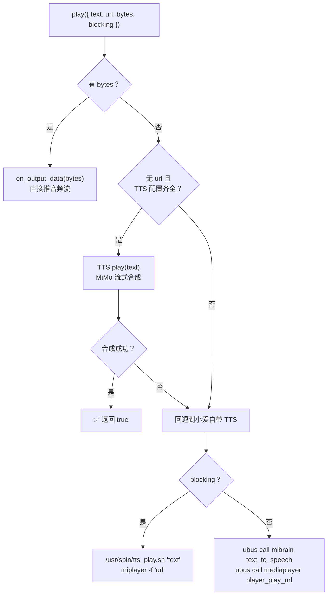

# Open-XiaoAI x MiGPT 端到端链路

本文梳理 `examples/migpt` 从**唤醒**到**语音输出**的完整链路。

## 一、核心设计

理解整条链路，先要抓住一个关键点：

> **open-xiaoai 不做唤醒词识别，也不做语音识别（ASR），而是「旁路观察」小爱音箱原生固件的识别结果。**

小爱音箱原生固件负责唤醒和云端 ASR，识别结果会写入日志文件 `/tmp/mico_aivs_lab/instruction.log`。
open-xiaoai 的 Rust 补丁程序通过 **tail 这个日志文件**（10ms 轮询）拿到识别出来的文字，转发给服务端。

因此整条链路里：

| 环节 | 由谁完成 |
| --- | --- |
| 唤醒（"小爱同学"） | 小爱原生固件 |
| 语音输入 + 语音识别（ASR） | 小爱原生固件（云端 ASR） |
| 文字获取 | open-xiaoai：tail `instruction.log` |
| 大模型问答 | 服务端 Node.js（MiGPT Engine） |
| 语音合成（TTS） | 服务端：MiMo TTS（可回退到小爱自带 TTS） |
| 语音输出 | 音箱端：`aplay` 播放 PCM 音频流 |

这也解释了为什么本项目能"完美打断"小爱：调用 AI 前先执行 `abortXiaoAI()` 重启 `mico_aivs_lab` 服务，掐掉小爱自己的回复，再用我们自己的 TTS 说话。

## 二、整体架构



## 三、端到端时序图

以用户说「**你好，你是谁？**」为例（`callAIKeywords` 命中前缀「你」）：



## 四、分阶段详解

### ① 唤醒

| 项目 | 说明 |
| --- | --- |
| 实现方 | **小爱原生固件**，open-xiaoai 不参与 |
| 触发 | 用户说「小爱同学」 |

**自定义唤醒词（可选）**：`examples/kws` 是独立模块（基于 sherpa-onnx），会把识别结果写入 `/tmp/open-xiaoai/kws.log`（格式 `时间戳@关键词`）。`KwsMonitor`（`packages/client-rust/src/services/monitor/kws.rs`）tail 该文件并上报 `kws` 事件。

> ⚠️ 在 migpt 中，`kws` 事件**仅打印日志**，不驱动任何业务逻辑（`migpt/xiaoai.ts:60-63`）。需要自定义唤醒词时要单独安装 `examples/kws`。

### ② 语音输入 + 语音识别（ASR）

| 项目 | 说明 |
| --- | --- |
| 实现方 | **小爱原生固件的云端 ASR** |
| 数据源 | `/tmp/mico_aivs_lab/instruction.log` |
| 监听 | `InstructionMonitor` → `FileMonitor`（10ms 轮询 tail） |
| 代码 | `packages/client-rust/src/services/monitor/instruction.rs` |

> ⚠️ **migpt 没有启用录音链路**。`src/server.rs` 中 `start_recording` 仍被注释掉，`AudioRecorder` 和 `record` 音频流未启用，`onRecord` 回调不会被触发。如需在 Node.js 端拿到原始录音流，需取消注释并重新编译。

日志中每行是一条 JSON，引擎只挑出满足以下全部条件的记录：

```
header.namespace === "SpeechRecognizer"
header.name      === "RecognizeResult"
payload.is_final === true
payload.results[0].text 非空
```

### ③ 事件上报：设备 → 服务端

```
InstructionMonitor
  → MessageManager.send_event("instruction", { NewLine: "..." })
  → WebSocket（:4399，二进制/文本帧）
  → AppServer::on_stream / on_event（examples/migpt/src/server.rs）
  → NodeManager::call_fn("on_event")   // Rust → JS 跨线程桥接（neon Channel）
  → global.RUST_CALLBACKS.on_event(json)
  → OpenXiaoAIEngine.onEvent（migpt/xiaoai.ts:33）
```

`onEvent` 处理三类事件：

| 事件 | 处理 |
| --- | --- |
| `instruction` | 解析 ASR 结果 → `onMessage()` 进入 AI 链路 |
| `playing` | 更新 `OpenXiaoAISpeaker.status`（playing/paused/idle） |
| `kws` | 仅 `console.log` |

### ④ 文本 → 大模型

`MiGPTEngine.onMessage`（`@mi-gpt/engine`）依次执行：

1. **取消上一条请求** — `OpenAI.cancel(lastMsg.id)`，用户抢话时立刻放弃上一次的 LLM 请求
2. **自定义钩子** — `config.onMessage(engine, msg)`，返回 `{ handled: true }` 可完全接管
3. **关键词过滤** — `callAIKeywords`（默认 `["请", "你"]`），消息必须以其中之一开头才会调用 AI
4. **打断小爱** — `await speaker.abortXiaoAI()`，重启 `mico_aivs_lab`（约 1-2 秒）
5. **发起流式请求** — `askAI()` → `ChatBot.chatWithStream()`，自动携带历史上下文（`historyMaxLength`，默认 10 条）

模型服务地址、密钥、温度、思考模式等参数统一在 `.env` 里配置，由 `config.ts` 通过 `envString()` / `getOpenAICreateParams()` 读取（`migpt/env.ts`）。

> 💡 `getOpenAICreateParams()` 只会把 `.env` 里**显式配置过**的参数（`OPENAI_TEMPERATURE`、`OPENAI_THINKING`）发给大模型，避免部分服务商收到不支持的参数直接报错。

#### 历史记忆（多轮对话）

`ChatBot`（`@mi-gpt/chat`）内部维护一个 `history` 数组，每次提问时把 **system 提示词 + 完整历史** 一起发给大模型，因此多轮对话记忆是**默认开启**的：

```
第 1 轮：system + user:你是谁？
第 2 轮：system + user:你是谁？ + assistant:回复1 + user:我叫小明
第 3 轮：system + user:你是谁？ + assistant:回复1 + user:我叫小明 + assistant:回复2 + user:我叫什么名字？
```

| 特性 | 说明 |
| --- | --- |
| 存储 | **纯内存数组**，无持久化，服务端重启即清空 |
| 作用域 | `ChatBot` 是全局单例，全局共享一份历史（单音箱场景够用） |
| 窗口大小 | `context.historyMaxLength`，默认 **10** |
| 淘汰策略 | 先进先出，**每次只淘汰一条**（`history.shift()`） |

**几个容易踩的点：**

1. **单位是「消息条数」，不是「对话轮数」** —— 一轮问答占 2 条（user + assistant），所以默认的 `10` 实际只能记住约 **5 轮**。想记 10 轮需要配 `20`。

2. **只有「走了 AI」的消息才进历史** —— `ChatBot` 只能通过 `askAI()` 到达，而 `askAI()` 被 `callAIKeywords` 挡着。因此：
   - 不以「请」「你」开头的消息 → 交回小爱原生处理，**不进历史**
   - `config.onMessage` 里自定义返回的回复 → 直连播放，**不进历史**

3. **淘汰按「条」不按「轮」，窗口可能以 assistant 开头** —— 用户提问被挤出窗口时，它对应的回复仍会留下，形成一条「没有问题的孤儿回复」。例如 `historyMaxLength: 4` 时：

   ```
   system | assistant:回复1 | user:我叫小明 | assistant:回复2 | user:我叫什么名字？
                ↑ 对应的提问「你是谁？」已被淘汰
   ```

   OpenAI 兼容接口（DeepSeek 等）能容忍这种顺序，不会报错，但会白占一个槽位。窗口配成偶数时会周期性出现。

4. **被打断的回复不会入库** —— `chatWithStream` 只在 `answer` 有值时才写入 assistant 消息。用户抢话打断时，提问已入库、回复却没有，历史里会留下连续两条 `user` 消息。

> 💡 **关于「设置为 0 可关闭」**：`config.ts` 注释说 `historyMaxLength: 0` 可关闭历史，而源码里是 `Math.max(1, historyMaxLength)`，`0` 会被抬成 `1`，看着像 bug。但结论是对的 —— 窗口为 1 时，每轮只会带上当前这条提问（旧消息在入库前就被 `shift()` 掉了），等价于单轮无记忆。

### ⑤ 大模型回复 → 流式分句

LLM 的 token 流写入 `StreamResponse`，按标点切句后逐句播报（`@mi-gpt/stream`）：

| 配置 | 默认值 |
| --- | --- |
| `sentenceEndings` | `。？！；?!;` |
| `maxReplyLength` | 200 |
| `firstReplyTimeout` | 500ms |

`_response()` 循环读取分句，**每句之间检查是否有新消息**，有则 `stream.cancel()` 立即打断：

```js
while (true) {
  const { next, noMore } = stream.read();
  if (!next && noMore) break;
  if (next) {
    if (this._hasNewMsg(ctx)) { stream.cancel(); return; }   // 用户抢话 → 打断
    await this.speaker.play({ text: next, blocking: true }); // 逐句阻塞播放
  }
  await sleep(100);
}
```

> 💡 引擎播报文字时**始终传 `blocking: true`**，依赖 `play()` 真正等到播完才返回，否则多句话会抢跑。

### ⑥ 语音合成（TTS）

`SpeakerManager.play()`（`migpt/speaker.ts`）的分发逻辑：



**启用条件**：`TTS.init()` 要求 `baseURL` / `apiKey` / `model` / `voice` **四项齐全**才会启用自定义 TTS；只配了一部分会打印告警并回退到小爱自带的语音合成服务；一项都没配则静默回退。四项均在 `.env` 里配置（`TTS_BASE_URL` / `TTS_API_KEY` / `TTS_MODEL` / `TTS_VOICE`）。

**MiMo TTS 调用**（`migpt/tts.ts`，OpenAI 兼容接口）：

```ts
client.chat.completions.create({
  model: "mimo-v2.5-tts",
  messages: [{ role: "assistant", content: text }],  // 注意：待合成文字走 assistant 角色
  audio: { format: "pcm16", voice: "mimo_default" },
  stream: true,
})
```

逐块读取 `delta.audio.data`（base64）→ 解码为 **24kHz PCM16LE 单声道** → `RustServer.on_output_data(bytes)`。

> 💡 **为什么要等待播放完毕？**
> 实测一句「你好，很高兴认识你！」：合成耗时约 **500ms**，但音频时长约 **2240ms** —— 合成比实时快约 **4.5 倍**。
> 若流结束就返回，`blocking: true` 会提前约 1.7 秒返回，导致下一句抢跑。
> 因此 `tts.ts` 按 `总字节数 ÷ 48000 字节/秒` 计算音频时长，扣除已流逝时间后 sleep 剩余时长。

### ⑦ 语音输出

```
on_output_data(bytes)                       // examples/migpt/src/lib.rs:34
  → MessageManager.send_stream("play", bytes)
  → WebSocket 二进制帧
  → client.rs on_stream()：tag === "play"   // packages/client-rust/src/bin/client.rs:165
  → AudioPlayer::play(bytes)
  → mpsc channel（容量 50）
  → aplay 子进程 stdin
  → 🔊 扬声器
```

`aplay` 启动参数由 `src/server.rs` 中 `start_play` 的 `AudioConfig` 决定：

```
aplay --quiet -t raw -f S16_LE -r 24000 -c 1 --buffer-size 1440 --period-size 360 -
```

> ⚠️ **必须启用 `start_play`**，否则 `AudioPlayer` 的 sender 为 `None`，`play()` 会静默丢弃音频（不报错、没声音）。
> 音频参数必须与 TTS 输出格式（24kHz / 16bit / 单声道）严格一致，否则会出现变调、加速或杂音。
> 修改 `src/server.rs` 后需要 `pnpm build` 重新编译 `open-xiaoai.node`。

## 五、通信协议

服务端与音箱端通过 **WebSocket（默认 `:4399`）** 通信。服务端是 Server，音箱端是 Client 主动连接（断线自动重连）。

消息类型 `AppMessage`（`packages/client-rust/src/services/connect/data.rs`）：

| 类型 | 方向 | 用途 |
| --- | --- | --- |
| `Event` | 设备 → 服务端 | `instruction`（ASR 结果）、`playing`（播放状态）、`kws`（唤醒词） |
| `Request` / `Response` | 双向 RPC | `run_shell`、`start_play`、`stop_play`、`start_recording`、`stop_recording`、`get_version` |
| `Stream` | 双向二进制 | `tag: "play"`（服务端 → 设备，播放）、`tag: "record"`（设备 → 服务端，录音） |

**`run_shell` 是能力底座**：`speaker.ts` 里几乎所有设备控制（播放/暂停、唤醒、麦克风开关、查询型号、切换启动分区、打断小爱）都是通过 RPC 在音箱上执行 `ubus` 命令或 shell 脚本实现的。

## 六、关键注意事项

1. **`start_play` 必须开启** —— 否则 TTS 音频流会被静默丢弃。改完 `src/server.rs` 要 `pnpm build`。
2. **采样率必须对齐** —— TTS 输出 24kHz 就必须配 `sample_rate: 24000`，两处不一致会变调。
3. **录音链路默认关闭** —— `start_recording` 仍是注释状态，`onRecord` 不会触发。
4. **ASR 依赖原生固件** —— 音箱必须能正常联网使用小爱的云端语音识别，否则 `instruction.log` 不会有识别结果，整条链路不会启动。
5. **`abortXiaoAI()` 有 1-2 秒恢复期** —— 期间小爱自带 TTS 不可用。配置了 MiMo TTS 后影响较小（走的是我们自己的音频流），但回退路径仍会受影响。
6. **关键词过滤** —— 默认只响应「请」「你」开头的消息，其余交回小爱原生处理。
7. **配置走 `.env`** —— 复制 `.env.example` 为 `.env` 填写密钥即可，启动命令 `tsx --env-file-if-exists=.env` 会自动加载；Docker 运行时也可直接用环境变量传入。TTS 四项配置缺一不可，否则回退到小爱自带 TTS。
8. **历史记忆是内存态的** —— `historyMaxLength` 的单位是消息条数（默认 10 ≈ 5 轮问答），重启即清空，且只有走 AI 的消息才会入库。详见 [④ 历史记忆](#历史记忆多轮对话)。

## 七、关键代码索引

| 环节 | 文件 |
| --- | --- |
| ASR 结果监听 | `packages/client-rust/src/services/monitor/instruction.rs` |
| 文件 tail 轮询 | `packages/client-rust/src/services/monitor/file.rs` |
| 唤醒词监听（可选） | `packages/client-rust/src/services/monitor/kws.rs` |
| 播放状态监听 | `packages/client-rust/src/services/monitor/playing.rs` |
| 音箱端主程序 | `packages/client-rust/src/bin/client.rs` |
| 音频播放（aplay） | `packages/client-rust/src/services/audio/play.rs` |
| 通信协议 | `packages/client-rust/src/services/connect/data.rs` |
| 服务端 WebSocket | `examples/migpt/src/server.rs` |
| Rust ↔ JS 桥接 | `examples/migpt/src/node.rs` · `src/lib.rs` |
| 引擎与事件分发 | `examples/migpt/migpt/xiaoai.ts` |
| 设备控制与播放分发 | `examples/migpt/migpt/speaker.ts` |
| 语音合成 | `examples/migpt/migpt/tts.ts` |
| 用户配置 | `examples/migpt/config.ts` |
| 环境变量读取 | `examples/migpt/migpt/env.ts` |
| 配置模板 | `examples/migpt/.env.example` |
