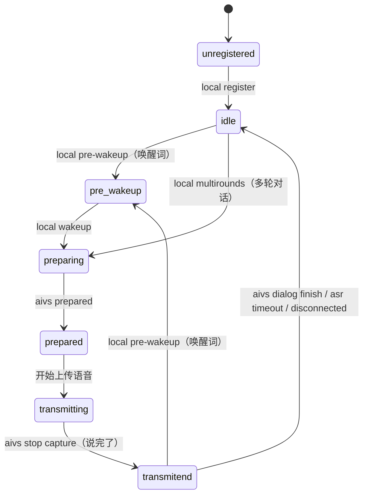

# 小爱音箱固件逆向与打补丁指南

本文记录改小爱音箱固件时踩出来的方法论和已知事实，供后续修改参考。

内容基于**小爱音箱 Pro（LX06）v1.94.13** 实测。具体的地址和数值换固件版本就会变，但方法和组件职责基本通用。

> [!TIP]
> 已有的实例见 `patches/LX06/04-mipns-multirounds.sh`（开启连续对话），它把本文的每条原则都用上了。

## 一、先解决可观测性，再动手

**这是最重要的一条。** 不解决观测手段就开始猜，会浪费掉几倍的时间。

### 日志在哪

```shell
tail -f /var/log/messages
```

固件用的是 **syslog-ng**，日志写在 `/var/log/messages`。

> [!WARNING]
> **这个固件没有 `logread`，也没有 `syslogd`**。按 OpenWrt 的常规习惯去找它们，只会得到 "not found" 或一片空白，从而误以为「没有日志」。

各组件的日志都很详细，`mipns` 甚至会把状态机的每一次跃迁都打出来：

```
[mipns::worker]:[W]local pre-wakeup, transmitend ---> pre-wakeup!
[mipns::worker]:[W]local multirounds when transmitend, ignore!
[mipns::notify]:[E]unexpected event type: 6!
```

**先 `tail -f /var/log/messages`，再发命令**——大部分问题设备会自己告诉你答案。

### 观测手段的陷阱

| 陷阱 | 说明 |
| --- | --- |
| `ubus call` 返回 `code: 0` **不等于成功** | `pnshelper event_notify` 只负责把事件递出去，没人处理照样返回 0。**不能用返回值判断补丁生效与否** |
| 进程的 stdout/stderr 是 `/dev/null` | `ls -la /proc/$(pidof mipns-xiaomi)/fd/1` 可确认。所以 `fprintf` 那类日志看不到，只有走 syslog 的能看到 |
| `instruction.log` 会被**截断重写** | aivs 每开一个新对话就把它清空重写，所以用 `wc -l` 算增量会得到 0 甚至**负数**。要比对内容（每行有唯一 `id`），别比行数 |
| 「唤醒了但没人说话」日志一片空白 | `RecognizeResult` 只有在**真的有人说话**时才产生。**不能用它判断设备有没有醒** ← 这个坑吃掉了我几个小时 |
| `ubus monitor` 的输出大部分是噪音 | 对象签名转储会把方法名刷屏，要 `grep '"method"'` 只看真正的 `invoke` |

### `ubus monitor` 怎么跑

设备上**没有 `nohup`，也没有 `setsid`**，后台跑 `ubus monitor` 让它活过 SSH 会话很麻烦。但通常不需要——在同一个脚本里跑就行：

```shell
ubus monitor > /tmp/mon.log 2>&1 &
MON=$!
sleep 1
ubus call pnshelper event_notify '{"src":3,"event":4,"detail":"1"}'
sleep 3
kill $MON
grep '"method"' /tmp/mon.log | grep -oE '"method":"[^"]+"' | sort | uniq -c
```

## 二、组件地图

搞清楚谁负责什么，能省掉大量瞎找。

| 组件 | 职责 | 关键点 |
| --- | --- | --- |
| **`mipns-xiaomi`** | 唤醒引擎 + **对话状态机** | 真正干活的。`xaudio_engine`（声学唤醒 `rice_wakeup`）也在里面 |
| `pns_ubus_helper` | ubus → mipns 的**转发层** | 只做 `(src, event)` → `type` 的映射，然后写 fifo 给 mipns。**不处理任何业务** |
| `mico_aivs_lab` | 云端对话（ASR / NLP / TTS） | 识别结果写进 `/tmp/mico_aivs_lab/instruction.log`，open-xiaoai 就是 tail 这个文件 |
| `mediaplayer` / `qplayer` / `ledserver` | 表现层 | 放音、点灯 |
| **`/bin/wakeup.sh`** | 表现层**脚本** | **被 mipns 调用**，负责放提示音、点灯。它是**结果不是原因**——直接跑它只会出声，不会真的唤醒 |

一次真实唤醒的完整链路（日志原文）：

```
rice_wakeup 1-level / 2-level                          ← 两级声学检测
xaudio_engine: real wakeup--
xaudio_engine: start send wakeup, asr_zero:0
[mipns::main]:[W]mipns_speech.event=wakeup-1! angle:340 ← 带声源测向
[mipns::worker]:[W]local pre-wakeup, idle ---> pre-wakeup!
wakeup.sh: WuW                                          ← 表现层（放音、点灯）
```

> [!IMPORTANT]
> **唤醒是纯声学的，没有任何 ubus/IPC 入口。** `speaker.ts` / `speaker.rs` 里的 `wakeUp()`（`src:0` / `src:1` + `event:0`）**在 LX06 上完全无效**——实测 `src:1` 是**闹钟**事件，mipns 收到后直接忽略。
> 想让音箱重新收音，唯一的办法是多轮对话（见 `04-mipns-multirounds.sh`）。

## 三、ubus：入口和已知映射

```shell
ubus list                    # 有哪些对象
ubus -v list pnshelper       # 方法签名（含参数名和类型）
ubus -v list mibrain
```

`ubus -v list` 给出的签名很有用，比如 `event_notify` 有个容易被忽略的 `detail` 参数：

```
"event_notify":{"src":"Integer","event":"Integer","detail":"String"}
"oneshot_set":{"open":"Boolean"}
```

### pnshelper 的 `src`

来自 `pns_ubus_helper` 的日志字符串（`enter pnshelper event notify src XXX!`）：

| src | 含义 | 备注 |
| --- | --- | --- |
| 1 | **alarm（闹钟）** | 实测确认。`wakeUp()` 用的就是它，所以那个函数是错的 |
| 3 | **other** | 实测确认。绝大多数有用的事件都在这里 |
| 0 / 2 | mp / app（推测） | 未实测 |

其余字符串里还能看到 `mibt mesh`、`mdspeech`。

### `src:3`（other）的 event 表

反汇编 `pns_ubus_helper` 的跳转表得到，并用日志逐条实测：

| event | 含义 | → mipns type | 实测结果 |
| --- | --- | --- | --- |
| 0 / 1 | pns start / stop | — | mipns 无响应 |
| 2 / 3 | voip on off | 3 | 已实现 |
| **4** | **pre multirounds** | **6** | 原版：`unexpected event type: 6!` ← 补丁目标 |
| 5 | voip | 7 | 已实现 |
| 6 | stop session | 8 | 原版：`unexpected event type: 8!` |
| **7** | **麦克风静音** | 9 | `enter notify wakeup mute: 1` |
| **8** | **麦克风取消静音** | 9 | `enter notify wakeup mute: 0` |
| 9 / 10 | power status 1 / 0 | 14 | 已实现 |
| 12 / 13 | mdspeech | 17 | 已实现 |

> [!CAUTION]
> **`event:7` 是静音、`event:8` 是取消静音**，别被数字顺序骗了。项目里 `setMic()` 一度写反，`setMic(true)` 会把麦克风哑掉。

`detail` 参数：`type` 的 bit 不在 `0x8501` 掩码里（即 type ∉ {0, 8, 10, 15}）时，**`detail` 必须非空**，否则直接返回 `-1`：

```
[pnshelper] invalid null pointer!
```

### mipns 的 notify type 表

`mipns-xiaomi` 的 notify 分发跳转表（55 项，`cmp r0,#54`）：

- **已实现**：0, 1, 2, 3, 7, 9, 10, 12, 13, 14, 15, 16, 17, 18, 50–54
- **未实现**（指向 default → `unexpected event type: N!`）：4, 5, 6, 8, 11, 19–49

> 注意：pnshelper 能发出的 type 是 mipns 支持范围的**子集**，而且不是恒等映射。

## 四、mipns 的对话状态机

搞懂这个才能理解为什么很多操作「没反应」。

状态枚举（来自多轮对话的状态跳转表，7 项）：

```
0 = unregistered   1 = idle          2 = pre-wakeup     3 = preparing
4 = prepared       5 = transmitting  6 = transmitend
```



关键性质：

1. **`local pre-wakeup` 能从任何状态跃迁**（`idle` / `preparing` / `prepared` / `transmitting` / `transmitend` 都行）。这就是唤醒词永远好使的原因。
2. **`local multirounds` 只接受 `idle`**，其余一律 `ignore`。
3. **`transmitend ---> idle` 只有三条路，全部由 aivs 驱动**：`aivs dialog finish` / `aivs asr timeout` / `aivs disconnected`。

第 3 条有个要命的后果：

> [!WARNING]
> **`abortXiaoAI()`（重启 `mico_aivs_lab`）会把状态机永久卡在 `transmitend`。**
>
> `examples/migpt` 每轮都要重启 aivs 来打断小爱。aivs 一死，上面三个通知谁也不会来——实测这三个事件在设备**整个日志里出现次数都是 0**。状态机再也回不到 `idle`。
>
> 平时没人察觉，是因为唤醒词走的 `local pre-wakeup` 能从任何状态跃迁。只有多轮对话卡在了 `idle` 这道门槛上。这正是 `04-mipns-multirounds.sh` 要打**两个**补丁的原因。

## 五、怎么把二进制弄下来

`/usr` 是只读 squashfs，`/data` 是可写 ubifs。

**用 `curl` 传，别的基本都不好使**：

| 方式 | 结果 |
| --- | --- |
| `scp` | ❌ 连不上（没有 sftp-server） |
| `nc` | ❌ BusyBox 版会**截断到 1024 的整数倍**，而且不支持 `-w` |
| `base64` / `od` | ❌ 设备上没有 |
| **`curl`** | ✅ 靠 Content-Length 保证完整 |

电脑上起个接收端：

```python
# recv.py：GET 发文件给音箱，PUT 从音箱收文件
import http.server, socketserver
class H(http.server.BaseHTTPRequestHandler):
    def do_PUT(self):
        n = int(self.headers['Content-Length'])
        open('out.bin', 'wb').write(self.rfile.read(n))
        self.send_response(200); self.end_headers()
    def do_GET(self):
        d = open('in.bin', 'rb').read()
        self.send_response(200)
        self.send_header('Content-Length', str(len(d)))
        self.end_headers(); self.wfile.write(d)
socketserver.TCPServer.allow_reuse_address = True
with socketserver.TCPServer(('', 8899), H) as s:
    s.handle_request()
```

```shell
# 音箱 -> 电脑
curl -s -X PUT --data-binary @/usr/bin/mipns-xiaomi http://<电脑IP>:8899/
# 电脑 -> 音箱
curl -s http://<电脑IP>:8899/ -o /data/mipns-patched && chmod +x /data/mipns-patched
```

**传完一定要核对大小**（`ls -la`），截断的 ELF 会少掉尾部的 section header，反汇编会失败。

## 六、反汇编定位法

```shell
objdump -d mipns-xiaomi > dis.txt
```

### 基址

ARM ELF 加载基址是 **`0x10000`**，即 `VMA = 文件偏移 + 0x10000`。用 `objdump -h` 的 `.text` VMA 反推可以验证。

### 识别跳转表

编译器把 `switch` 编成这样：

```
20138: e3530006     cmp   r3, #6                    ← case 数量
2013c: 979ff103     ldrls pc, [pc, r3, lsl #2]      ← 跳转表
20140: eaxxxxxx     b     <default>                 ← 越界走 default
20144: ...............                              ← 表从这里开始
```

**表的地址 = `ldrls` 指令地址 + 8**（ARM 的 PC 领先 8 字节），也就是 `cmp` 的地址 + 12。

objdump 会把表项误当指令解（显示成 `andeq` 之类的），**直接读 4 字节小端整数**即可。

`default` 分支就是**表里出现次数最多的那一项**——这个技巧很好用，比硬找 `b <default>` 稳。

### 字符串 → 代码：三步引用链

固件日志字符串极多，是最好的路标。从字符串反查到代码：

```
字符串 VMA  →  字面量池里存它地址的那个 4 字节  →  ldr rX,[pc,#imm] 引用该池地址的指令
```

```python
import struct
BASE = 0x10000
data = open('mipns-xiaomi', 'rb').read()

def ldr_ref(text):
    vma = data.find(text.encode()) + BASE          # 1. 字符串地址
    pool = data.find(struct.pack('<I', vma)) + BASE # 2. 字面量池条目
    for off in range(0, len(data) - 4, 4):          # 3. 引用它的 ldr
        w = struct.unpack_from('<I', data, off)[0]
        # ldr rX, [pc, #imm]，取值时 PC = 指令地址 + 8
        if (w & 0xFFFF0000) == 0xE59F0000 and (off + BASE) + 8 + (w & 0xFFF) == pool:
            yield off + BASE
```

> [!CAUTION]
> 掩码是 **`0xFFFF0000`**（保留 cond + opcode + Rn=PC，清掉 Rd）。写成 `0xFFF0F000` 匹配不到任何东西——我在这上面卡过一次。

找到日志调用点后，往前扫几条就能找到函数入口（典型模式是 `if (verbose) fprintf(...)` 的前导判断）。

### 模式不唯一时靠字符串消歧

`cmp r3,#6 + ldrls pc` 这种 7 状态机的模式，在 `mipns-xiaomi` 里有 **12 处**。光靠模式匹配一定会选错表。

**做法**：用各分支**独有的日志字符串**交叉验证——确认它们的调用点分别落在对应表项指向的区块里：

```python
idle_log = ldr_ref("[mipns::worker]:[W]local multirounds, idle ---> preparing!")
tend_log = ldr_ref("[mipns::worker]:[W]local multirounds when transmitend, ignore!")
# 只有满足 entries[1] <= idle_log < entries[2] 且 entries[6] <= tend_log 的那张才是
```

> [!TIP]
> 每个状态都有**独立的**字符串（`when preparing, ignore!` / `when transmitend, ignore!` …），而不是一个 `when %s, ignore!` 的格式串。这说明每个 case 都是独立分支，可以逐项改写——**格式串则意味着只有一个通用分支，就没这么好改了**。判断依据：`strings` 里能不能找到写死状态名的那句。

## 七、安全的试错循环：bind mount

**不用刷机也能测补丁**，而且重启即还原、零变砖风险。

```shell
# 1. 把改好的二进制传到 /data（用上面的 curl 方式）
# 2. 挂上去
/etc/init.d/pns stop        # 运行中的进程占着文件，不停就 umount 不掉
mount -o bind /data/mipns-patched /usr/bin/mipns-xiaomi
/etc/init.d/pns start

# 3. 还原
/etc/init.d/pns stop
umount /usr/bin/mipns-xiaomi
/etc/init.d/pns start
```

`mount` 支持 `bind`；bind mount **不持久化**，所以拔电重启就回到原样。

脚本里一定要带**自动回滚**：

```shell
/etc/init.d/pns start >/dev/null 2>&1
sleep 9
if [ -z "`pidof mipns-xiaomi`" ]; then
    echo "!! 起不来，回滚"
    umount /usr/bin/mipns-xiaomi
    /etc/init.d/pns restart
    exit 1
fi
```

想让它开机自动生效（**仍然不用刷机**）：补丁固件会在开机时执行 `/data/init.sh`，把 mount 写进去即可。注意：

- 要插在**启动 client 那行之前**——那行是阻塞的，写在后面永远不会执行
- 别整个覆盖 `/data/init.sh`，它默认就是 open-xiaoai 客户端的自启动脚本

实例见音箱上的 `/data/multirounds.sh`。

## 八、写补丁脚本的原则

`patch.sh` 会自动执行 `patches/$MODEL/` 下的所有 `*.sh`，**工作目录是 `squashfs-root`**，所以直接改 `usr/bin/xxx` 即可。构建环境（Docker）里有 `python3`、`bash`、`file`、`patch`、`openssl`、`squashfs-tools`。

1. **动态定位，绝不写死偏移量**。`03-libxaudio_engine.sh` 就是范例（用 `strings -t d` 找偏移）。硬编码的偏移换个固件版本就会**默默改错地方**，比报错危险得多。
2. **每一步都校验，对不上就 `exit 1`**。宁可拒绝打补丁，也不能改错字节。
3. **幂等**。重复执行要能干净地识别「已经打过了」并退出，且不破坏文件。
4. **改完核对大小**。改跳转表这类补丁必须是等长的，文件大小不能变。
5. **本地先验**。在 `squashfs-root` 的副本上跑一遍，和实机验证过的二进制 `cmp` 对比。

验证补丁脚本的最小闭环：

```shell
mkdir -p fake/usr/bin && cp mipns-xiaomi fake/usr/bin/
cd fake && bash ../patches/LX06/04-mipns-multirounds.sh
cmp usr/bin/mipns-xiaomi ../已验证的二进制   # 必须完全一致
bash ../patches/LX06/04-mipns-multirounds.sh # 再跑一次，必须干净地拒绝
```

## 九、血泪教训

按吃亏程度排序：

1. **不解决可观测性就动手**。`syslog-ng` 一直在往 `/var/log/messages` 写，而我因为找不到 `logread`/`syslogd` 就以为「没日志」，靠猜浪费了几个小时。**先找日志。**
2. **用了一个不成立的观测指标**。拿「`instruction.log` 有没有新增 `RecognizeResult`」判断设备有没有醒——但唤醒后**没人说话就不会有 ASR 结果**，日志本来就是空的。这个假阴性让我得出过好几个自信但错误的结论。**观测指标一定要先用「已知会成功」的操作做阳性对照。**
3. **信了 `code: 0`**。`ubus` 返回 0 只代表命令被收下，不代表有人处理。补丁没生效时它照样返回 0。
4. **信了代码注释**。项目里 `wakeUp()` 注释写着「静默唤醒」，实际是闹钟事件，**从来没工作过**；`setMic()` 的 on/off 是反的，我照着它发命令，把麦克风哑掉了。**祖传魔法数字要用日志实测，别信注释。**
5. **用了没人调用过的分支**。`wakeUp()` 的 `src:0` 分支全项目零调用——这种代码大概率没被验证过。**下手前先 `grep` 一下有没有人真的在用。**

## 十、已知的固件事实速查

| 事实 | 影响 |
| --- | --- |
| `wakeUp()`（`src:0`/`src:1` + `event:0`）在 LX06 上**完全无效** | `examples/kws` 的自定义唤醒词（`monitor.rs` 用的同一条命令）大概率也是坏的——只放提示音不唤醒 |
| `setMic()` 的 `event:7`=静音、`event:8`=取消静音 | 搞反会哑掉麦克风 |
| 唤醒是纯声学的，无外部入口 | 想重新收音只能靠多轮对话补丁 |
| `abortXiaoAI()` 把状态机卡死在 `transmitend` | 多轮对话必须打第二个补丁才能用 |
| 多轮对话窗口 **7 秒**，固件写死 | 不用自己做定时器；超时自动退出，不会一直收音 |
| `/bin/wakeup.sh` 是表现层 | 直接跑它只会出声，不会唤醒 |
| `oneshot_set` / `oneshot_get` 存在但 | mipns 里有 `oneshot open not support` 字符串，未深究 |
